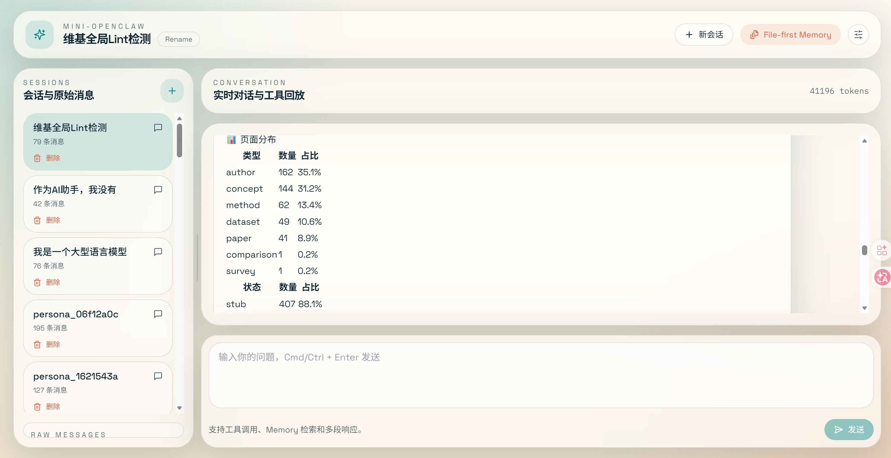
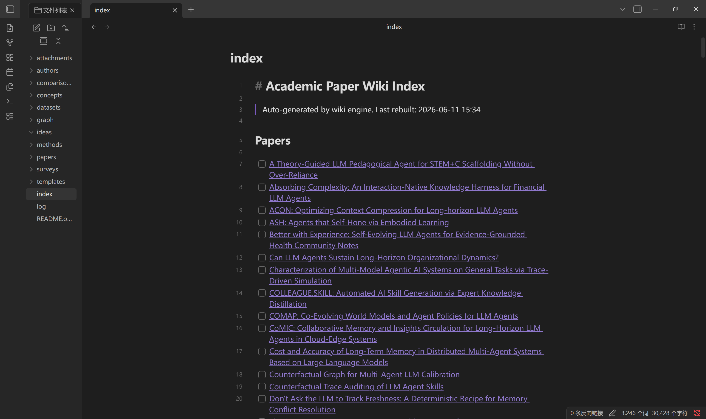

# PaperMind-Agent

面向学术研究的本地化 AI Agent 工作台，具备双轨记忆系统、Wiki 知识管理、分层安全治理与知识熵管控能力。

<p align="center">
  
</p>

<p align="center">
  
</p>

## 核心特性

### 双轨记忆系统

系统同时运行两条完全独立的记忆管线：

- **长期记忆金字塔**（PostgreSQL + pgvector）：四层渐进抽象 — L0 原始对话 → L1 结构化原子事实（LLM 提取 + LLM-as-Judge 去重）→ L2 主题场景块 → L3 用户画像。每轮对话自动捕获，空闲超时或事实积累到阈值时逐层聚合，召回时三层并行检索（pgvector 余弦 + tsvector BM25 + RRF 融合）。

- **短期记忆管线**（文件存储）：符号化 Offload 管道 — L1 工具结果摘要（可替换分数 0-10）→ L1.5 任务生命周期判断 → L2 Mermaid 流程图生成（含认知墓碑标记失败路径）→ L3 温和/激进/紧急三级渐进压缩。解决长对话中工具输出撑爆上下文窗口的问题。

### Wiki 知识管理

三层 Obsidian 兼容架构：原始文件（SHA-256 去重）→ 8 种实体页（paper/concept/method/dataset/author/survey/comparison/idea，`[[wikilink]]` 交叉引用）→ 模板与标签分类。Wiki 引擎提供 8 个工具（注册、读写、检索、索引重建、Lint 修复等），检索采用 BM25 jieba 分词 + embedding 余弦相似度 + RRF 融合。

### 知识熵管理

识别 6 类知识熵源（重复页面、悬空引用、孤立页面、内容过期、碎片化、上下文污染）并自动治理。每次论文消化后自动运行 Lint 检测 + 回填修复（RED/YELLOW/BLUE 三级严重度）。

### 分层安全治理

五层中间件链按序执行：
1. **Guardian** — 独立 LLM 分类器，前置提示词注入防御，fail-closed 设计
2. **Harness Security** — 三层工具拦截（受保护路径 glob + 危险命令正则 + YAML 自定义规则热加载）
3. **Context Offload** — 上下文压缩中间件
4. **Summarization** — 对话历史压缩
5. **Harness Review** — LLM 驱动的五维后置质量审查（quality_score / hallucination_risk / tool_audit / issues / summary）

### arXiv 论文消化系统

每日自动运行：RSS 抓取 5 个类别 → 双重过滤（关键词 + embedding 语义排序）→ LLM 七维结构化分析 → 实体提取（概念/方法/数据集）→ 自动生成 Wiki 页面 → 标签分类（16 个研究领域）→ 企业微信推送摘要。

### 技能系统

基于 `SKILL.md` 文件的可扩展框架，10 个内置技能：`ideate`（研究 idea 生成）、`paper-ingest`（论文导入）、`paper-update`（增量更新）、`quick-lookup`（快速检索）、`rag-skill`（本地 RAG）、`web-search`（网页搜索）、`wiki-ask`（Wiki 检索问答）、`wiki-lint`（Wiki 健康检查）等。

## 技术架构

```
┌─────────────────────────────────────────────────────┐
│                    Frontend                          │
│          Next.js 14 + React 18 + TypeScript          │
│               Tailwind CSS + Monaco Editor            │
└────────────────────────┬────────────────────────────┘
                         │ SSE Streaming
┌────────────────────────▼────────────────────────────┐
│                    Backend                           │
│               FastAPI + LangChain 1.x                │
├─────────────────────────────────────────────────────┤
│  Middleware Chain (按序执行):                          │
│  Guardian → HarnessSecurity → ContextOffload          │
│  → Summarization → HarnessReview                     │
├─────────────────────────────────────────────────────┤
│  Agent Tools (13+):                                  │
│  terminal | python_repl | fetch_url | read_file      │
│  PDF | wiki_engine (8 tools)                         │
│  search_memory_v3 | drill_down                       │
├─────────────────────────────────────────────────────┤
│  双轨记忆:                                            │
│  长期: L0→L1→L2→L3 (PostgreSQL + pgvector)           │
│  短期: L1→L1.5→L2→L3 (文件 + Mermaid)                │
├─────────────────────────────────────────────────────┤
│  Wiki 引擎: BM25 jieba + embedding, RRF 融合          │
│  知识熵: 6 类检测 + 自动治理                            │
├─────────────────────────────────────────────────────┤
│  arXiv 消化: RSS → 双重过滤 → LLM → Wiki              │
├─────────────────────────────────────────────────────┤
│  技能系统: 10 个 SKILL.md, 按需加载                     │
└────────────────────────┬────────────────────────────┘
                         │
           ┌─────────────┴─────────────┐
           │     PostgreSQL + pgvector  │
           │   (长期记忆 + checkpointer) │
           └───────────────────────────┘
```

## 快速开始

### 环境要求

- Python 3.10+
- Node.js 18+
- PostgreSQL（需安装 pgvector 扩展）

### 后端启动

```bash
cd backend

# 创建虚拟环境
python -m venv .venv
# Windows
.venv\Scripts\activate
# Linux/Mac
source .venv/bin/activate

# 安装依赖
pip install -r requirements.txt

# 配置环境变量
cp config/.env.example config/.env
# 编辑 .env 填入 API Key

# 启动服务（端口 8002）
uvicorn app:app --host 0.0.0.0 --port 8002 --reload
```

### 前端启动

```bash
cd frontend
npm install
npm run dev    # http://localhost:7788
```

### 运行测试

```bash
cd backend
pytest tests/ -v

# 单独运行
pytest tests/test_guardian.py           # Guardian 中间件
pytest tests/test_harness_security.py   # 安全规则（34 个用例）
pytest tests/test_harness_review.py     # 审查中间件（11 个用例）
```

## 配置说明

### 环境变量（`backend/config/.env`）

| 变量 | 说明 | 可选值 |
|------|------|--------|
| `LLM_PROVIDER` | LLM 供应商 | `zhipu` / `bailian` / `deepseek` / `openai` |
| `EMBEDDING_PROVIDER` | Embedding 供应商 | 同上 / `local` |
| `*_API_KEY` | 对应供应商的 API Key | — |
| `MEMORY_BACKEND` | 记忆系统版本 | `off` / `v3` |
| `MEMORY_V3_INJECT` | v3 记忆注入模式 | `always`（默认）/ `tool` / `off` |
| `GUARDIAN_ENABLED` | 启用注入防御 | `true`（默认）/ `false` |
| `GUARDIAN_FAIL_MODE` | Guardian 失败策略 | `closed`（阻断，默认）/ `open`（放行） |
| `SUMMARIZATION_ENABLED` | 启用对话压缩 | `true` / `false`（默认） |
| `CHECKPOINTER` | 状态持久化方式 | `postgres` 或留空 |
| `HARNESS_ENABLED` | 启用 Harness 系统 | `true`（默认）/ `false` |
| `HARNESS_SECURITY_ENABLED` | 工具级安全拦截 | `true`（默认）/ `false` |
| `HARNESS_REVIEW_ENABLED` | 后置质量审查 | `true`（默认）/ `false` |
| `ARXIV_DIGEST_ENABLED` | 启用 arXiv 每日消化 | `true`（默认）/ `false` |
| `ARXIV_DIGEST_HOUR` | 消化执行时间（小时） | 默认 `8`（Asia/Shanghai） |
| `WECHAT_WEBHOOK_KEY` | 企业微信推送 Webhook | — |

### 供应商别名

在 `LLM_PROVIDER` / `EMBEDDING_PROVIDER` 中可使用别名：

- `glm` / `zhipuai` / `bigmodel` → `zhipu`
- `aliyun` / `dashscope` / `qwen` → `bailian`
- `siliconflow` → `deepseek`

### Offload 管线配置

| 变量 | 说明 | 默认值 |
|------|------|--------|
| `MEMORY_V3_OFFLOAD_L1_THRESHOLD` | L1 触发的 ToolPair 数量 | 4 |
| `MEMORY_V3_OFFLOAD_L1_SIZE_THRESHOLD` | 单条输出触发 L1 的字符数 | 3000 |
| `MEMORY_V3_OFFLOAD_L2_NULL_THRESHOLD` | L2 触发的空节点数量 | 4 |
| `MEMORY_V3_OFFLOAD_MILD_RATIO` | 温和压缩阈值 | 0.5 |
| `MEMORY_V3_OFFLOAD_AGGRESSIVE_RATIO` | 激进压缩阈值 | 0.85 |
| `MEMORY_V3_OFFLOAD_EMERGENCY_RATIO` | 紧急压缩阈值 | 0.95 |

### 运行时配置（`backend/config/config.json`）

通过 `/api/config` 端点动态修改，无需重启。

### Harness 安全规则（`backend/config/harness_rules.yaml`）

热加载配置，修改即时生效。定义敏感文件模式、危险命令正则、自定义拦截规则。

## 安全说明

项目中涉及 API Key、数据库密码等敏感信息的配置文件（`.env`、`config/.env`）已通过 `.gitignore` 排除，不会被提交到 GitHub。克隆仓库后需自行创建配置文件：

```bash
cd backend/config
cp .env.example .env
# 编辑 .env 填入你的 API Key 和数据库连接信息
```

> **注意：** 请勿将 `.env` 文件提交到版本控制。如果误提交了包含密钥的文件，即使后续删除，密钥仍会保留在 git 历史中。建议在提交前检查 `git status` 确认无敏感文件。

## 项目结构

```
PaperMind-Agent/
├── backend/
│   ├── app.py                  # FastAPI 入口（lifespan 初始化）
│   ├── api/                    # REST 端点
│   │   ├── chat.py             # SSE 流式对话（token/tool_start/tool_end/done）
│   │   ├── sessions.py         # 会话 CRUD + 压缩
│   │   ├── digest.py           # arXiv 消化端点（status/test/run）
│   │   ├── files.py            # 文件读写（白名单）+ 技能列表
│   │   ├── tokens.py           # Token 计数
│   │   └── config_api.py       # 运行时配置
│   ├── graph/                  # Agent 核心
│   │   ├── agent.py            # AgentManager 单例（编排 recall/capture/streaming）
│   │   ├── agent_factory.py    # 中间件链组装 + Agent 构建
│   │   ├── guardian.py         # 提示词注入防御（LLM 分类器）
│   │   ├── harness_security.py # 工具级安全拦截（YAML 热加载）
│   │   ├── harness_review.py   # 后置质量审查（LLM 五维评分）
│   │   ├── context_offload.py  # 上下文压缩中间件
│   │   ├── llm.py              # LLM/Embedding 工厂（多供应商）
│   │   └── checkpointer.py     # 双模式状态持久化
│   ├── memory_module_v3/       # 双轨记忆系统
│   │   ├── capture/            # L0 自动捕获
│   │   ├── extract/            # L1 LLM 事实提取 + LLM-as-Judge 去重
│   │   ├── consolidate/        # L2 场景块聚合
│   │   ├── persona/            # L3 用户画像合成
│   │   ├── pipeline/           # 生命周期管理 + 指数退避调度器
│   │   ├── retrieval/          # 混合检索（pgvector + tsvector + RRF）
│   │   ├── storage/            # PostgreSQL 存储层
│   │   ├── integrations/       # Agent 工具 + 中间件注入
│   │   └── offload/            # 符号化短期记忆管线（L1/L1.5/L2/L3）
│   ├── service/                # 业务服务
│   │   ├── arxiv_service.py    # arXiv RSS + 语义排序
│   │   ├── digest_pipeline.py  # 论文消化管道
│   │   ├── wiki_retriever.py   # Wiki 混合检索（BM25 + embedding + RRF）
│   │   ├── prompt_builder.py   # 系统提示词组装
│   │   ├── scheduler.py        # APScheduler 每日调度
│   │   └── wechat_notifier.py  # 企业微信推送
│   ├── tools/                  # Agent 工具集（13+）
│   │   ├── wiki_engine_tool.py # 8 个 Wiki 引擎工具
│   │   └── skills_scanner.py   # 技能扫描与快照生成
│   ├── skills/                 # 10 个内置技能（SKILL.md）
│   ├── workspace/              # 系统提示词（SOUL/IDENTITY/USER/AGENTS/MEMORY）
│   ├── config/                 # 配置文件
│   └── tests/                  # 测试套件
├── frontend/
│   └── src/
│       ├── app/                # Next.js 页面
│       ├── components/         # React 组件（chat/editor/layout）
│       └── lib/                # 状态管理与 API 客户端
└── scripts/                    # 工具脚本
```

## 许可证

MIT License
