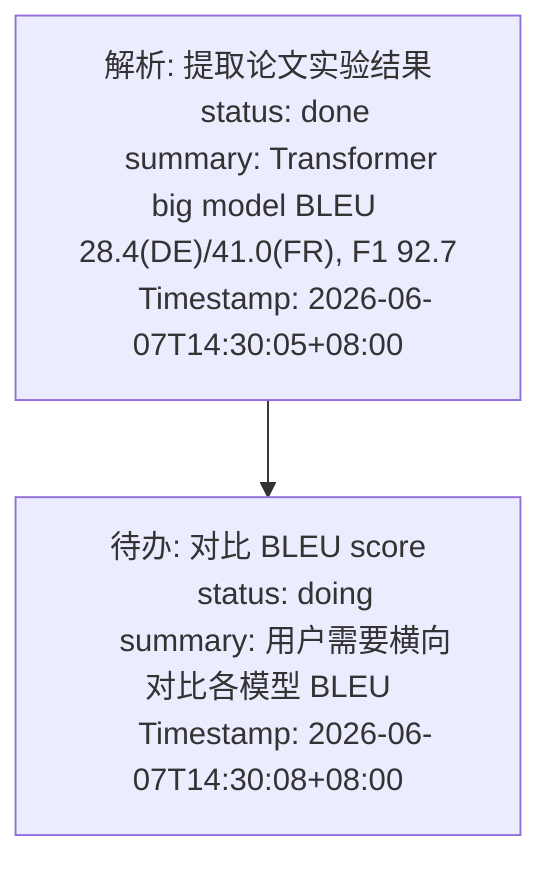

# 记忆机制全流程举例说明

以"橘子助手"（学术研究助手）的实际使用场景为例，逐步讲解记忆系统如何存储、检索和压缩。

---

## 场景设定

用户 "李博" 是一名 AI 方向的研二学生，正在用橘子助手帮自己读论文、整理知识库、梳理研究脉络。

**会话 thread_id:** `sess_research_001`

---

## 第 1 轮对话：导入一篇 Transformer 论文

### 用户发送

```
"帮我 ingest 这篇论文 Attention Is All You Need，arXiv 1706.03762"
```

### 1. 短时记忆 — Checkpointer 保存状态

Checkpointer 将这轮对话的状态写入存储：

**InMemorySaver（默认）或 PostgreSQL（`CHECKPOINTER=postgres`）：**

```
thread_id: sess_research_001
checkpoint: {
    messages: [
        {role: "user", content: "帮我 ingest 这篇论文 Attention Is All You Need..."},
        {role: "assistant", content: "好的，正在导入这篇论文..."},
        {role: "tool", content: "register_source 返回: 已注册, hash=abc123..."},
        {role: "tool", content: "pdf_parser 返回: 提取了 15 页内容..."},
        {role: "assistant", content: "论文已导入，创建了以下页面：paper/attention-is-all-you-need, concept/self-attention, method/multi-head-attention..."}
    ],
    step: 5,
    ...
}
```

> Checkpointer 存的是 LangGraph 的完整状态快照（消息列表、工具调用状态、当前步骤），不仅仅是文本。Postgres 中用 `langgraph-checkpoint-postgres` 包的 schema 存储，包含 `checkpoints`、`checkpoint_blobs`、`checkpoint_writes` 等表。

### 2. 长期记忆 — L0 自动捕获

`agent.py` 的 `astream()` 结束后，`L0Recorder.capture()` 执行：

**写入文件 `memory_module_v3/l0/sess_research_001.json`：**

| msg_id | role | content | ts |
|--------|------|---------|-----|
| 1 | user | 帮我 ingest 这篇论文 Attention Is All You Need，arXiv 1706.03762 | 2026-06-07 14:00:00 |
| 2 | assistant | 好的，正在导入这篇论文。已注册原始资料，解析了 15 页 PDF... | 2026-06-07 14:00:12 |

> L0 是全量捕获，不做任何过滤，不含 embedding（向量在 L1 提取时计算）。

### 3. 通知 PipelineManager

```python
await _v3_pipeline.notify_conversation("sess_research_001", [1, 2])
```

PipelineManager 更新状态：

```
state.conversation_count = 1
state.buffered_message_ids = [1, 2]
state.warmup_threshold = 1   # 初始值
```

检查 L1 触发条件：`conversation_count(1) >= warmup_threshold(1)` → **触发 L1！**

---

## 第 2 轮对话：讨论 Self-Attention 机制

### 用户发送

```
"这篇论文的 self-attention 和传统的 attention 有什么区别？为什么能并行？"
```

此时 L1 已在后台异步运行（处理第 1 轮的消息）。同时第 2 轮的 L0 捕获也完成了。

**L0 表新增：**

| msg_id | session_id | role | content |
|--------|-----------|------|---------|
| 3 | sess_research_001 | user | 这篇论文的 self-attention 和传统的 attention 有什么区别？为什么能并行？ |
| 4 | sess_research_001 | assistant | Self-attention 的核心区别在于 Q/K/V 都来自同一序列...传统 attention 是 cross-attention，Q 来自 decoder，K/V 来自 encoder...并行化是因为去掉了 RNN 的顺序依赖... |

### L1 提取过程（后台异步）

`L1Extractor` 读取 `buffered_message_ids = [1, 2]`，调用 LLM：

**LLM 输入：**
```
[system] You are a memory extraction system. Extract atomic, self-contained memories...
[user] Extract memories from this conversation.
--- NEW MESSAGES ---
[user] 帮我 ingest 这篇论文 Attention Is All You Need，arXiv 1706.03762
[assistant] 好的，正在导入这篇论文。已注册原始资料，解析了 15 页 PDF。创建了以下页面：paper/attention-is-all-you-need, concept/self-attention, method/multi-head-attention...
--- END ---
```

**LLM 输出（JSON）：**
```json
[
  {
    "scene_name": "transformer_architecture",
    "message_ids": [1, 2],
    "memories": [
      {
        "content": "用户导入了论文 Attention Is All You Need (Vaswani et al., 2017, NeurIPS)，arXiv 1706.03762",
        "type": "episodic",
        "priority": 7
      },
      {
        "content": "该论文提出 Transformer 架构，核心是 self-attention 机制和 multi-head attention",
        "type": "episodic",
        "priority": 5
      },
      {
        "content": "用户正在研究 Transformer 架构相关工作",
        "type": "persona",
        "priority": 6
      }
    ]
  }
]
```

### L1 去重过程

`L1Deduplicator` 两层去重：先内容哈希去精确重复，再对语义相似候选调 LLM 决策 merge/store。

- 这是第一批事实，数据库中没有已有事实 → 哈希未命中、无相似候选 → 全部 `store`

**写入 PostgreSQL `memory_v3.l1_facts`：**

| fact_id | content | fact_type | priority | scene_name | source_msg_ids | session_id |
|---------|---------|-----------|----------|------------|---------------|-----------|
| 1 | 用户导入了论文 Attention Is All You Need (Vaswani et al., 2017, NeurIPS)，arXiv 1706.03762 | episodic | 7 | transformer_architecture | {1,2} | sess_research_001 |
| 2 | 该论文提出 Transformer 架构，核心是 self-attention 机制和 multi-head attention | episodic | 5 | transformer_architecture | {1,2} | sess_research_001 |
| 3 | 用户正在研究 Transformer 架构相关工作 | persona | 6 | transformer_architecture | {1,2} | sess_research_001 |

> `content_tsv` 是 PostgreSQL 自动生成的 `tsvector` 列（表中未画出），使用 `simple` 分词器。embedding 异步回填。

### PipelineManager 更新状态

```
state.conversation_count = 2
state.buffered_message_ids = []      # 已清空
state.warmup_threshold = 2           # 1→2（翻倍）
state.last_l1_at = now
state.pending_l2 = True              # 标记 L2 待执行
```

L2 调度：新增事实 ≥ `l2_trigger_n_facts`（10）立即触发；否则等待 `l2_delay_after_l1`（120 秒）后兜底触发。

---

## 第 3 轮对话：ContextOffload 实例（符号化短期记忆管线）

### 用户发送

```
"帮我把论文里的实验结果表格整理出来，我想对比一下 BLEU score"
```

### Agent 调用 pdf_parser 工具

Agent 调用 `pdf_parser` 解析论文第 12-14 页（实验部分），返回结果：

**原始输出（3800 字符）：**
```
Table 1: Machine Translation Results (English to German)
Model                          BLEU    Params    Training Cost
                               (newstest2014)    (FLOPs)
LSTM                          24.6    213M      7.7 × 10^19
...
Transformer (base model)      27.3    65M       3.3 × 10^18
Transformer (big model)       28.4    213M      2.3 × 10^19

Table 2: Machine Translation Results (English to French)
...
Transformer (big model)       41.0    213M      ...

Table 3: English Constituency Parsing
Transformer                    92.7 (self-attention only, no task-specific tuning)
```

### ContextOffload 管线介入

`ContextOffloadMiddleware.wrap_tool_call()` 检测到输出 > 500 字符（阈值），收集 ToolPair 到缓冲区。当累积到 4 个 ToolPair 时，触发 L1。

**L1 — LLM 摘要生成：**

调用 LLM（"工具结果摘要器"），结合对话上下文生成语义摘要：

```json
[
  {
    "tool_call": "pdf_parser: 解析 Attention Is All You Need 论文实验部分",
    "summary": "Transformer big model 在 WMT 2014 EN-DE 达到 28.4 BLEU，EN-FR 达到 41.0 BLEU；Parsing 任务 92.7 F1，均超越此前所有模型",
    "tool_call_id": "call_pdf_001",
    "score": 9
  }
]
```

- `score=9` 表示摘要高度可替代原文（关键数据点已提取）
- 完整结果存入 `refs/ref_7a8b9c0d1e2f.md`

**L1.5 — 任务生命周期判断：**

```json
{
  "taskCompleted": false,
  "isLongTask": true,
  "isContinuation": false,
  "newTaskLabel": "transformer-paper-analysis"
}
```

→ 创建 `mmds/transformer-paper-analysis-001.mmd`

**L2 — LLM Mermaid 生成（"任务拓扑架构师"）：**



L2 的弹性聚合：多个连续的实验表格解析合并为一个 N1 节点（结论导向），而非逐行罗列。

**L3 — 渐进式压缩 + MMD 注入：**

`before_model` 执行两个独立操作：

1. **摘要替换（瘦身）：** 当 context 使用率 ≥ 50%，按 L1 的 `score` 从高到低，将旧工具结果替换为纯文本摘要：
   ```
   [Offloaded Tool Result | node: N1]
   Summary: Transformer big model BLEU 28.4(DE)/41.0(FR)...
   result_ref: refs/ref_7a8b9c0d1e2f.md (read this file for full tool call and raw result)
   ```
   原本 3800 字符 → 约 200 字符

2. **MMD 注入（补视图）：** 如果有活跃的 MMD 文件，将 Mermaid 任务图作为 `HumanMessage` 注入对话上下文

### Agent 如何取回完整结果

如果用户后续说 "把 Table 2 的完整数据也给我看看"，Agent 通过 `result_ref` 路径读取完整原文：

```python
# 摘要中包含 result_ref: refs/ref_7a8b9c0d1e2f.md
# Agent 读取该文件即可获取完整的 pdf_parser 输出（包含所有表格）
read_file("refs/ref_7a8b9c0d1e2f.md")
```

---

## 第 3-5 轮对话（快速过）

用户继续讨论了 Positional Encoding、Layer Normalization、训练策略等。每轮都走相同流程：L0 捕获 → 缓冲 → L1 提取。

**L0 表增长到 10 行（5 轮 × 2 条/轮）**

**L1 表增长到约 10 条事实：**

| fact_id | content | fact_type | scene_name |
|---------|---------|-----------|------------|
| 1 | 用户导入了论文 Attention Is All You Need (Vaswani et al., 2017) | episodic | transformer_architecture |
| 2 | 该论文提出 Transformer 架构，核心是 self-attention 机制 | episodic | transformer_architecture |
| 3 | 用户正在研究 Transformer 架构相关工作 | persona | transformer_architecture |
| 4 | Self-attention 的 Q/K/V 来自同一序列，可并行计算 | instruction | transformer_architecture |
| 5 | Transformer 在 WMT 2014 EN-DE 上达到 28.4 BLEU（big model） | episodic | transformer_architecture |
| 6 | 用户在整理 Transformer 的实验数据，关注 BLEU score | persona | transformer_architecture |
| 7 | Positional Encoding 用正弦/余弦函数编码位置信息 | instruction | transformer_architecture |
| 8 | 用户导入了 BERT 论文 (Devlin et al., 2019) | episodic | bert_pretraining |
| 9 | BERT 使用 Masked LM 和 Next Sentence Prediction 做预训练 | episodic | bert_pretraining |
| 10 | 用户在对比 BERT 和 GPT 的预训练策略差异 | persona | bert_pretraining |

**warmup 退避过程：**
```
第 1 轮: threshold=1, count=1  → 触发 L1, threshold→2
第 2 轮: threshold=2, count=2  → 触发 L1, threshold→4
第 3 轮: threshold=4, count=3  → 不触发（pdf_parser 结果被 ContextOffload 压缩）
第 4 轮: threshold=4, count=4  → 触发 L1, threshold→8
第 5 轮: threshold=8, count=5  → 不触发
```

---

## 第 5 轮后：L2 场景整合触发

120 秒后（`l2_delay_after_l1`），L2 调度器检查：`pending_l2=True` 且延迟已过 → 触发 L2。

### L2 整合过程

`SceneExtractor` 读取所有 10 条 L1 事实，调用 LLM：

**LLM 输出：**
```json
[
  {
    "scene_name": "transformer_architecture",
    "summary": "用户在深入研究 Transformer 架构，包括 self-attention、positional encoding 和实验结果",
    "fact_ids": [1, 2, 3, 4, 5, 6, 7],
    "content": "## Transformer 架构研究\n\n用户导入了 Attention Is All You Need (Vaswani et al., 2017, NeurIPS)。\n\n### 核心机制\n- Self-attention: Q/K/V 来自同一序列，可并行计算\n- Positional Encoding: 正弦/余弦函数编码位置信息\n\n### 实验结果\n- WMT 2014 EN-DE: big model 达到 28.4 BLEU\n- English Constituency Parsing: 92.7 F1\n\n### 用户关注点\n- 整理实验数据，对比 BLEU score\n- 研究 Transformer 架构相关工作"
  },
  {
    "scene_name": "bert_pretraining",
    "summary": "用户在研究 BERT 的预训练策略，对比不同预训练方法",
    "fact_ids": [8, 9, 10],
    "content": "## BERT 预训练研究\n\n用户导入了 BERT (Devlin et al., 2019)。\n\n### 预训练方法\n- Masked Language Model (MLM)\n- Next Sentence Prediction (NSP)\n\n### 用户关注点\n- 对比 BERT 和 GPT 的预训练策略差异"
  }
]
```

**写入 Markdown 文件（`memory_module_v3/scenes/`）：**

| 文件 | scene_name | summary | fact_ids |
|------|-----------|---------|----------|
| `transformer_architecture.md` | transformer_architecture | 用户研究 Transformer 架构、self-attention 与位置编码 | {1,2,3,4,5,6,7} |
| `bert_pretraining.md` | bert_pretraining | 用户对比 BERT 与 GPT 的预训练策略 | {8,9,10} |

同时更新 `scenes/_index.json` 导航索引（含 summary）。

---

## L3 用户画像生成（50 条事实后）

经过多轮对话，L1 事实总数达到 50 条。触发 L3。

### 读取所有 L2 场景

```markdown
## transformer_architecture
用户在深入研究 Transformer 架构...

## bert_pretraining
用户在研究 BERT 的预训练策略...

## llm_scaling_laws
用户在阅读 Scaling Laws for Neural Language Models...

## agent_memory_systems
用户在调研 Agent 长期记忆方案...

## rag_techniques
用户在整理 RAG 相关技术...
```

### LLM 生成用户画像

存入 `memory_module_v3/persona.md`：

```markdown
## Identity
李博是一名 AI 方向的研二学生，研究兴趣集中在大语言模型和 Agent 系统。具备扎实的深度学习基础，熟悉 PyTorch 生态。

## Preferences
- 喜欢先读论文 Overview 再决定是否精读
- 偏好结构化的知识整理（wiki 页面格式）
- 关注实验数据和定量结果，不满足于定性描述
- 学术术语保留英文原文，解释用中文

## Goals
- 当前在梳理 Transformer → BERT → GPT → LLM 的技术演进脉络
- 正在调研 Agent 长期记忆方案，为自己的研究选题做准备
- 需要对比不同预训练策略的优劣

## Context
- 已导入 5 篇核心论文到 wiki 知识库
- 正在写文献综述的 Related Work 部分
- 最近关注 RAG 和 Agent Memory 两个方向

## Scene Navigation
- [[transformer_architecture]]
- [[bert_pretraining]]
- [[llm_scaling_laws]]
- [[agent_memory_systems]]
- [[rag_techniques]]
```

---

## 第 20 轮对话：检索注入实例

用户发消息：`"帮我对比一下 GPT 和 BERT 的预训练目标，我论文的 Related Work 要写这部分"`

### RecallService 并行检索

```
query = "帮我对比一下 GPT 和 BERT 的预训练目标，我论文的 Related Work 要写这部分"
```

**① L1 向量搜索（pgvector）：**

```sql
SELECT fact_id, content, 1 - (embedding <=> $1::vector) AS cosine_sim
FROM memory_v3.l1_facts
WHERE embedding IS NOT NULL
ORDER BY embedding <=> $1::vector
LIMIT 20
```

返回（按余弦相似度排序）：
| fact_id | content | cosine_sim |
|---------|---------|-----------|
| 9 | BERT 使用 Masked LM 和 Next Sentence Prediction 做预训练 | 0.91 |
| 10 | 用户在对比 BERT 和 GPT 的预训练策略差异 | 0.88 |
| 18 | GPT 使用自回归语言建模（left-to-right）做预训练 | 0.86 |
| 25 | GPT-2 去掉了 NSP，发现效果更好 | 0.79 |
| 42 | RoBERTa 去掉 NSP，用动态 masking 替代静态 masking | 0.75 |
| 15 | 用户在写文献综述的 Related Work 部分 | 0.72 |

**② L1 关键词搜索（tsvector）：**

```sql
SELECT fact_id, content, ts_rank_cd(content_tsv, plainto_tsquery('simple', $1)) AS rank_score
FROM memory_v3.l1_facts
WHERE content_tsv @@ plainto_tsquery('simple', $1)
ORDER BY rank_score DESC
LIMIT 20
```

返回（按文本相关度排序）：
| fact_id | content | rank_score |
|---------|---------|-----------|
| 9 | BERT 使用 Masked LM 和 Next Sentence Prediction 做预训练 | 0.92 |
| 18 | GPT 使用自回归语言建模（left-to-right）做预训练 | 0.88 |
| 10 | 用户在对比 BERT 和 GPT 的预训练策略差异 | 0.75 |
| 25 | GPT-2 去掉了 NSP，发现效果更好 | 0.65 |

**③ RRF 融合：**

```
RRF(k=60) = Σ 1/(60 + rank + 1)

fact_id=9:  向量排名0 + 关键词排名0 → 1/61 + 1/61 = 0.0328
fact_id=10: 向量排名1 + 关键词排名2 → 1/62 + 1/63 = 0.0320
fact_id=18: 向量排名2 + 关键词排名1 → 1/63 + 1/62 = 0.0320
fact_id=25: 向量排名3 + 关键词排名3 → 1/64 + 1/64 = 0.0313
fact_id=42: 向量排名4               → 1/65                       = 0.0154
fact_id=15: 向量排名5               → 1/66                       = 0.0152
```

最终排序（取 top 5）：fact_id 9, 10, 18, 25, 42

### 注入到消息列表

```python
# agent.py:109-112

# L3 persona + L2 scene navigation → system message
turn_messages.append({"role": "system", "content": """
<user-persona>
## Identity
李博是一名 AI 方向的研二学生，研究兴趣集中在大语言模型和 Agent 系统...

## Preferences
- 喜欢先读论文 Overview 再决定是否精读
- 关注实验数据和定量结果...
- 学术术语保留英文原文，解释用中文

## Goals
- 当前在梳理 Transformer → BERT → GPT → LLM 的技术演进脉络
- 正在写文献综述的 Related Work 部分
...
</user-persona>

<scene-navigation>
- transformer_architecture (15 facts) — 用户研究 Transformer 架构、self-attention 与位置编码
- bert_pretraining (12 facts) — 用户对比 BERT 与 GPT 的预训练策略
- llm_scaling_laws (8 facts) — 用户阅读 Scaling Laws 相关论文
- agent_memory_systems (10 facts) — 用户调研 Agent 长期记忆方案
- rag_techniques (5 facts) — 用户整理 RAG 相关技术
</scene-navigation>
"""})

# L1 facts → assistant message
turn_messages.append({"role": "assistant", "content": """
<relevant-memories>
- [episodic] BERT 使用 Masked LM 和 Next Sentence Prediction 做预训练
- [persona] 用户在对比 BERT 和 GPT 的预训练策略差异
- [episodic] GPT 使用自回归语言建模（left-to-right）做预训练
- [episodic] GPT-2 去掉了 NSP，发现效果更好
- [episodic] RoBERTa 去掉 NSP，用动态 masking 替代静态 masking
</relevant-memories>
"""})

# 用户消息
turn_messages.append({"role": "user", "content": "帮我对比一下 GPT 和 BERT 的预训练目标，我论文的 Related Work 要写这部分"})
```

最终发给 LLM 的消息序列：
```
system:    <user-persona>...<scene-navigation>...
assistant: <relevant-memories>...
user:      帮我对比一下 GPT 和 BERT 的预训练目标...
```

Agent 基于记忆上下文，直接生成结构化的对比内容，无需用户再解释背景。

---

## 批量压缩（before_model）实例

假设会话进行了 30 轮，用户导入了 5 篇论文，每篇都调用了 `pdf_parser`。`before_model` hook 在 LLM 调用前检查：

```
消息列表:
[user, assistant, tool(pdf_parser, 4200chars), assistant,
 user, assistant, tool(pdf_parser, 3800chars), assistant,
 user, assistant, tool(query_wiki, 200chars), tool(save_wiki_page, 300chars), assistant,
 ...
 user, assistant, tool(pdf_parser, 5100chars), assistant]
 ↑ 旧消息（前 20 轮）                              ↑ 最近 10 轮 ↑
 ↓ 压缩                                           ↓ 保留原样
```

- 最近 10 轮（`history_window`）的工具消息 → 保留原样
- 更早的 `pdf_parser` 结果（> 3000 字符）→ 替换为 L1 纯文本摘要（含 node_id + summary + result_ref）
- 小工具结果（`query_wiki` 200 字符、`save_wiki_page` 300 字符）→ 不压缩（< 阈值）

---

## 长期记忆存储一览

### PostgreSQL memory_v3 schema（L1 + 流水线状态）

```
memory_v3
├── l1_facts             -- 原子事实（结构化 + 向量 + 全文索引）
└── pipeline_state       -- 每个 session 的流水线状态
```

### 各存储内容对比

| 存储 | 存什么 | 谁写入 | 何时写入 | 用途 |
|------|--------|--------|----------|------|
| PostgreSQL `l1_facts` | 结构化事实：content, type, priority, scene, embedding, tsvector | L1Extractor + Dedup | 每 N 轮（指数退避） | 检索的核心数据 |
| PostgreSQL `pipeline_state` | session 的对话计数、warmup 阈值、缓冲消息 ID、时间戳 | PipelineManager | 每轮更新 | 调度触发条件 |
| 文件 `l0/{session_id}.json` | 每条 user/assistant 消息原文（无 embedding） | L0Recorder | 每轮对话后 | L1 提取的素材 |
| 文件 `scenes/*.md` + `_index.json` | 主题场景块：Markdown 叙事 + summary/fact_ids（frontmatter） | SceneExtractor | L1 后 120 秒 | 场景导航 |
| 文件 `persona.md` | 用户画像 Markdown | PersonaGenerator | 50 条事实后 | 注入 system prompt |

### 向量索引情况

| 存储 | 向量列 | 索引类型 | 说明 |
|------|--------|----------|------|
| PostgreSQL `l1_facts` | `embedding vector(1024)` | HNSW（注释状态，需手动启用） | 主检索表 |
| PostgreSQL `l1_facts` | `content_tsv TSVECTOR` | GIN | 关键词检索 |

---

## 短时记忆 vs 长期记忆：一张图

```
┌─────────────────────────────────────────────────────────────────┐
│                  当前会话 (sess_research_001)                     │
│                                                                  │
│  ┌──────────────────────────────────────────────────────────┐   │
│  │                   短时工作记忆                             │   │
│  │                                                           │   │
│  │  Checkpointer          Summarization      ContextOffload  │   │
│  │  (状态快照)             (消息压缩)          (工具结果压缩)   │   │
│  │  ┌─────────┐          ┌──────────┐       ┌────────────┐  │   │
│  │  │messages │          │ 当消息>50 │       │ pdf_parser │  │   │
│  │  │tools    │          │ 时压缩为  │       │ 输出>500字 │  │   │
│  │  │step     │          │ 摘要      │       │ → Mermaid  │  │   │
│  │  │...      │          │          │       │ → ref_id   │  │   │
│  │  └─────────┘          └──────────┘       └────────────┘  │   │
│  │  重启丢失/Postgres持久  保留最近20条        完整结果存文件   │   │
│  └──────────────────────────────────────────────────────────┘   │
│                                                                  │
│  ┌──────────────────────────────────────────────────────────┐   │
│  │                   长期记忆 (memory_v3)                     │   │
│  │                                                           │   │
│  │  L0 原始对话    L1 原子事实    L2 场景块    L3 用户画像     │   │
│  │  ┌─────────┐   ┌──────────┐  ┌────────┐  ┌──────────┐   │   │
│  │  │每条消息  │──→│结构化事实 │──→│主题聚合 │──→│用户画像   │   │   │
│  │  │原文      │   │+去重+向量│  │Markdown│  │Markdown  │   │   │
│  │  └─────────┘   └──────────┘  └────────┘  └──────────┘   │   │
│  │  每轮自动       每N轮触发     L1后120秒    50条事实后      │   │
│  │  跨会话持久，重启不丢失                                    │   │
│  └──────────────────────────────────────────────────────────┘   │
└─────────────────────────────────────────────────────────────────┘
```

---

## ContextOffload 符号化短期记忆管线

```
工具返回结果
    │
    ├─ 长度 <= 500 字符 → 原样通过，不压缩
    │
    └─ 长度 > 500 字符 → 收集 ToolPair 到缓冲区
        │
        ├─ 缓冲区满 4 对 → 触发 L1
        │   → LLM 生成语义摘要（≤200字符）+ 可替换性评分（0-10）
        │   → 完整结果存入 refs/*.md
        │
        ├─ L1 完成 → 触发 L1.5
        │   → LLM 判断任务生命周期
        │   → 管理 MMD 文件（创建/激活/清除）
        │
        ├─ null entry ≥ 4 → 触发 L2
        │   → LLM 生成/更新 Mermaid 流程图
        │   → 弹性聚合 + 认知墓碑 + 结论导向
        │
        └─ context 使用率 ≥ 50% → 触发 L3
            ├─ 50-85%: 按 score 替换工具结果为 L1 纯文本摘要（瘦身）
            ├─ 85-95%: 删除最旧 30% 消息
            └─ > 95%: 强制截断到 60%

        └─ 有活跃 MMD 文件 → 注入 Mermaid 任务图（补视图）
            └─ 作为 HumanMessage 插入到最后一条 user 消息之后
```
