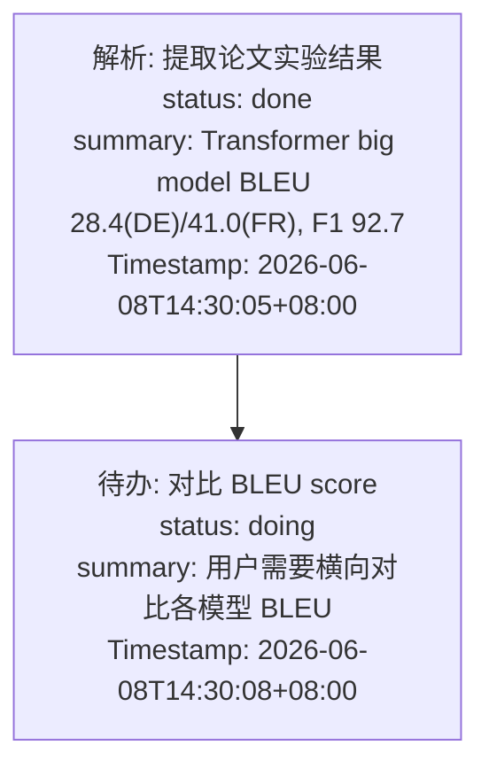
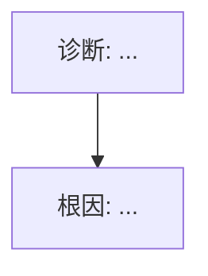

# Memory V3 实现详解：长期记忆与短期记忆全流程

以"橘子助手"（学术研究助手）的实际使用场景为例，结合源码中的类、函数和数据结构，逐步讲解记忆系统的实现。

---

## 场景设定

用户 "李博" 是一名 AI 方向的研二学生，正在用橘子助手帮自己读论文、整理知识库。

**会话 thread_id:** `sess_research_001`

---

## 一、长期记忆：四层金字塔（L0 → L1 → L2 → L3）

长期记忆由 `memory_module_v3` 的 Core Pipeline 实现，采用**分层存储**：L1 事实与流水线状态存 PostgreSQL，L0/L2/L3 为本地文件。

```
L3  用户画像 (Persona)          ← 全局单例，最稳定
     ↑ 合成
L2  场景块 (Scene Blocks)       ← 按主题组织，中期
     ↑ 整合
L1  原子事实 (Atomic Facts)     ← 结构化记忆，可检索
     ↑ 提取
L0  原始对话 (Raw Messages)     ← 每轮自动捕获
```

### 1.1 第 1 轮对话：导入论文

**用户发送：**

```
"帮我 ingest 这篇论文 Attention Is All You Need，arXiv 1706.03762"
```

**Agent 回复：**

```
好的，正在导入这篇论文。已注册原始资料，解析了 15 页 PDF。
创建了以下页面：paper/attention-is-all-you-need, concept/self-attention...
```

#### L0 捕获：`L0Recorder.capture()`

**触发时机：** 每次 LLM 对话结束后，`agent.py` 的 `astream()` 结束后自动执行。

**源码位置：** `memory_module_v3/capture/l0_recorder.py`

```python
class L0Recorder:
    def __init__(self, l0_repo: L0FileRepo):
        self._repo = l0_repo

    async def capture(self, session_id, user_message, assistant_response, *, user_ts=None, assistant_ts=None):
        user_msg = L0Message(session_id=session_id, role="user", content=user_message, ts=user_ts)
        asst_msg = L0Message(session_id=session_id, role="assistant", content=assistant_response, ts=assistant_ts)
        return self._repo.insert_batch([user_msg, asst_msg])   # -> (user_id, asst_id)
```

**写入文件 `memory_module_v3/l0/sess_research_001.json`：**

| msg_id | role | content | ts |
|--------|------|---------|-----|
| 1 | user | 帮我 ingest 这篇论文 Attention Is All You Need... | 2026-06-08 14:00:00 |
| 2 | assistant | 好的，正在导入这篇论文。已注册原始资料... | 2026-06-08 14:00:12 |

> L0 是全量捕获，不做任何过滤，不含 embedding（向量在 L1 提取时计算）。

#### 通知 PipelineManager

```python
# agent.py 中调用
await _v3_pipeline.notify_conversation("sess_research_001", [1, 2])
```

**源码位置：** `memory_module_v3/pipeline/manager.py`

```python
class PipelineManager:
    async def notify_conversation(self, session_id, message_ids):
        state = await self._get_or_create_state(session_id)
        state.conversation_count += 1
        state.buffered_message_ids.extend(message_ids)

        # 检查 L1 触发条件
        if self._scheduler.should_run_l1(state):
            asyncio.create_task(self._run_l1(session_id, state))
```

**PipelineScheduler 判断是否触发 L1：**

**源码位置：** `memory_module_v3/pipeline/scheduler.py`

```python
class PipelineScheduler:
    def should_run_l1(self, state: PipelineSessionState) -> bool:
        # 条件1：对话轮数 >= 预热阈值（指数退避）
        if state.conversation_count >= state.warmup_threshold:
            return True
        # 条件2：距上次 L1 超过空闲超时（默认 300 秒）
        if state.last_l1_at and (now - state.last_l1_at).total_seconds() > self._config.l1_idle_timeout_seconds:
            return True
        return False
```

**当前状态：** `conversation_count=1 >= warmup_threshold=1` → **触发 L1！**

---

### 1.2 L1 提取与去重

#### L1 提取：`L1Extractor.extract()`

**源码位置：** `memory_module_v3/extract/l1_extractor.py`

```python
class L1Extractor:
    async def extract(self, session_id, message_ids, *, background_ids=None) -> list[L1Fact]:
        # 1. 读取新消息
        new_msgs = self._l0.get_by_ids(message_ids)
        # 2. 构建背景上下文（最近 10 条旧消息，每条截断 200 字符）
        background_section = ""
        if background_ids:
            bg_msgs = self._l0.get_by_ids(background_ids)
            if bg_msgs:
                bg_lines = [f"[{m['role']}] {m['content'][:200]}" for m in bg_msgs[-10:]]
                background_section = "Previous context:\n" + "\n".join(bg_lines)
        # 3. 格式化新消息为 "[role] content" 格式
        new_messages = "\n".join(f"[{m['role']}] {m['content']}" for m in new_msgs)
        # 4. 调用 LLM 提取 SceneSegment[]（prompt 约束 JSON 输出，见下文）
        user_prompt = EXTRACT_USER.format(
            background_section=background_section,
            new_messages=new_messages,
        )
        raw_response = await self._llm_fn(EXTRACT_SYSTEM, user_prompt)
        # 5. 解析 JSON（带 fallback：去 code fence → json.loads → 提取括号）
        segments = self._parse_segments(raw_response)
        # 6. 转换为 L1Fact 对象
        facts = []
        for seg in segments:
            for mem in seg.memories:
                facts.append(L1Fact(
                    content=mem.get("content", ""),
                    fact_type=mem.get("type", "episodic"),
                    priority=mem.get("priority", 0),
                    scene_name=seg.scene_name,
                    source_msg_ids=seg.message_ids,
                    session_id=session_id,
                ))
        return facts
```

**LLM 输入（EXTRACT_SYSTEM + EXTRACT_USER）：**

```
[system] You are a memory extraction system. Extract atomic, self-contained memories...

[system] Memory types:
- persona: User's identity, preferences, traits, background
- episodic: Events, activities, experiences
- instruction: Rules, instructions, guidelines given by the user

Rules:
1. Each memory must be self-contained (understandable without context)
2. Keep memories concise (1-2 sentences max)
3. Do NOT duplicate obvious facts
4. Prefer specific facts over vague generalizations
5. Output valid JSON only

[user] Extract memories from this conversation.

Previous context:
[assistant] 我可以帮你查看最新的 arXiv 论文...

--- NEW MESSAGES ---
[user] 帮我 ingest 这篇论文 Attention Is All You Need，arXiv 1706.03762
[assistant] 好的，正在导入这篇论文。已注册原始资料，解析了 15 页 PDF...
--- END ---
```

**LLM 输出（JSON）：**

```json
[
  {
    "scene_name": "transformer_architecture",
    "message_ids": [1, 2],
    "memories": [
      {
        "content": "用户导入了论文 Attention Is All You Need (Vaswani et al., 2017, NeurIPS)，arXiv 1706.03762",
        "type": "episodic",
        "priority": 0
      },
      {
        "content": "该论文提出 Transformer 架构，核心是 self-attention 机制和 multi-head attention",
        "type": "episodic",
        "priority": 0
      },
      {
        "content": "用户正在研究 Transformer 架构相关工作",
        "type": "persona",
        "priority": 0
      }
    ]
  }
]
```

> **priority 字段说明：** 整数类型，存储在 `l1_facts` 表中。用于检索时 `ORDER BY priority DESC` 排序（高优先级事实优先召回），并在 L1 去重时作为 LLM 上下文传入（`new_priority`）。当前 prompt 中默认值为 0，LLM 可根据事实重要性调整数值。

**LLM 结构化输出约束：**

系统不依赖 OpenAI function calling 或 JSON mode，而是通过 **prompt-only JSON 约束 + 容错解析** 实现结构化输出：

1. **Prompt 约束：** System prompt 明确要求 "Output valid JSON only"，User prompt 给出精确的 JSON schema 示例，末尾强调 "Return ONLY the JSON, no other text"
2. **容错解析（`_parse_segments()`）：** 三层 fallback 确保健壮性：
   - 第一层：去除 markdown code fence（`` ``` ``）后直接 `json.loads()`
   - 第二层：用 `text.find("[")` / `text.rfind("]")` 提取 JSON 数组子串再解析
   - 第三层：解析失败返回空列表，跳过本轮提取

#### L1 去重：`L1Deduplicator.dedup()`（两层：哈希 + 一次 LLM）

**源码位置：** `memory_module_v3/extract/l1_dedup.py`

**第一层 — 内容哈希去重（确定性、零 LLM 调用）：**

```python
# l1_repo.py: content_hash() 归一化 content（去空白、小写）→ SHA-256
existing_hashes = self._l1.content_hash_index()   # 现有事实 content 哈希集合
for fact in new_facts:
    h = content_hash(fact.content)
    if h in existing_hashes:
        continue        # 精确重复 → 丢弃（不调 LLM、不搜索）
```

**第二层 — 语义合并（LLM，仅当存在相似候选时才调用）：**

```python
async def dedup(self, new_facts):
    # Tier 1: 精确去重
    existing_hashes = self._l1.content_hash_index()
    keep = [f for f in new_facts if content_hash(f.content) not in existing_hashes]

    # Tier 2: 语义合并
    results = []
    for fact in keep:
        candidates = await self._search_fn(fact.content, top_k=3)   # search_facts: dense+keyword
        if not candidates:
            results.append(fact)               # 无相似候选 → store
            continue

        decision = await self._decide(fact, candidates)              # 只对候选调 LLM
        if decision.get("decision") == "merge" and decision.get("target_fact_id"):
            existing = self._l1.get_by_id(decision["target_fact_id"])
            if existing:
                fact.fact_id = decision["target_fact_id"]            # 并入旧事实
                fact.source_msg_ids = list(
                    set((existing.get("source_msg_ids") or []) + fact.source_msg_ids)
                )                                                    # 证据取并集
        results.append(fact)                 # merge 成功则复用旧行,否则 store
    return results
```

> `search_fn` 由 `PipelineManager` 注入，实际是 `RecallService.search_facts`（pgvector dense + tsvector keyword）。

**去重决策（LLM，只对"有相似候选"的事实调用）：**

| 决策 | 含义 | 操作 |
|------|------|------|
| `merge` | 与候选旧事实是同一事实 | 打上 `target_fact_id`，source_msg_ids 取并集，复用旧行 |
| `store` | 全新 / 仅表面相似 | 直接插入新行 |

**去重 Prompt（DEDUP_SYSTEM + DEDUP_USER，2 元决策）：**

```
[system] You are a memory deduplication system. Given a new memory and a list of
existing similar memories, decide whether to merge or store.

Decisions:
- merge: The new memory is the SAME fact as an existing one (same meaning, possibly
  different wording or a small update). Merge it into the single best-matching
  existing memory and return that memory's fact_id.
- store: The new memory is genuinely new, or only superficially similar. Store it
  as a separate memory.

Rules:
1. Merge ONLY when the new memory and an existing memory refer to the same fact
2. If the new memory adds meaningfully new information, store
3. When in doubt, store — under-merging is safer than over-merging

[user] New memory to evaluate:
"用户导入了论文 Attention Is All You Need (Vaswani et al., 2017)"

Type: episodic
Priority: 0

Existing similar memories:
- [fact_id=42] 用户导入了论文 Attention Is All You Need (arXiv 1706.03762)
- [fact_id=43] 用户正在研究 Transformer 架构相关工作

Return JSON:
{
  "decision": "merge",
  "target_fact_id": 42,
  "reason": "Same paper, new memory adds author/journal detail"
}
```

> **容错策略：** `_parse_decision()` 使用与提取相同的三层 fallback 解析。LLM 调用失败或搜索失败时，默认 decision 为 `"store"`（宁可存入重复，也不丢失新事实）。

**写入 PostgreSQL `memory_v3.l1_facts`：**

| fact_id | content | fact_type | priority | scene_name | source_msg_ids | session_id |
|---------|---------|-----------|----------|------------|---------------|-----------|
| 1 | 用户导入了论文 Attention Is All You Need (Vaswani et al., 2017) | episodic | 0 | transformer_architecture | {1,2} | sess_research_001 |
| 2 | 该论文提出 Transformer 架构，核心是 self-attention 机制 | episodic | 0 | transformer_architecture | {1,2} | sess_research_001 |
| 3 | 用户正在研究 Transformer 架构相关工作 | persona | 0 | transformer_architecture | {1,2} | sess_research_001 |

> `content_tsv` 是 PostgreSQL 自动生成的 `tsvector` 列（`GENERATED ALWAYS AS to_tsvector('simple', content)`），用于关键词检索。embedding 异步回填。

#### PipelineManager 更新状态

```python
# L1 完成后
state.conversation_count = 1
state.buffered_message_ids = []      # 已清空
state.warmup_threshold = 2           # 1→2（翻倍）
state.last_l1_at = now
state.pending_l2 = True              # 标记 L2 待执行
```

**指数退避预热（`advance_warmup()`）：**

```python
# scheduler.py:49 — 每次 L1 完成后阈值翻倍，上限为 pipeline_every_n
state.warmup_threshold = min(state.warmup_threshold * 2, cfg.pipeline_every_n)
```

```
第 1 轮: count=1, threshold=1  → 触发 L1, threshold → min(1×2, 5) = 2
第 2 轮: count=2, threshold=2  → 触发 L1, threshold → min(2×2, 5) = 4
第 3 轮: count=3, threshold=4  → 不触发（积攒上下文）
第 4 轮: count=4, threshold=4  → 触发 L1, threshold → min(4×2, 5) = 5
第 5 轮: count=5, threshold=5  → 触发 L1, threshold → 5（到达上限，稳定）
第 6-9 轮:                    → 不触发（积攒足够上下文）
第10 轮: count=10, threshold=5 → 触发 L1（此后每 5 轮触发一次）
```

**为什么用指数退避：**

1. **冷启动问题：** 新会话只有 1-2 条消息，此时调 LLM 提取记忆效果差——信息太少，提取出的事实要么质量低（过于笼统），要么数量少到没有去重意义
2. **快速种子积累：** 前几轮阈值小（1→2→4），密集触发 L1，快速积累一批种子事实，为后续去重和 L2 场景聚合提供基础
3. **避免浪费 token：** 积攒足够上下文后，阈值稳定到 `pipeline_every_n`，避免每轮都调 LLM 造成 token 浪费
4. **空闲超时保底：** 除了轮数阈值，还有 `l1_idle_timeout_seconds`（默认 300 秒）兜底——即使轮数没到阈值，用户 5 分钟没说话也会触发提取，防止长时间对话中的消息被遗漏

---

### 1.3 第 3-5 轮对话（快速过）

用户继续讨论了 Positional Encoding、Layer Normalization、训练策略，又导入了 BERT 论文。每轮都走相同流程：L0 捕获 → 缓冲 → L1 提取。

**L0 表增长到 10 行（5 轮 × 2 条/轮）**

**L1 表增长到约 10 条事实：**

| fact_id | content | fact_type | scene_name |
|---------|---------|-----------|------------|
| 1 | 用户导入了论文 Attention Is All You Need (Vaswani et al., 2017) | episodic | transformer_architecture |
| 2 | 该论文提出 Transformer 架构，核心是 self-attention 机制 | episodic | transformer_architecture |
| 3 | 用户正在研究 Transformer 架构相关工作 | persona | transformer_architecture |
| 4 | Self-attention 的 Q/K/V 来自同一序列，可并行计算 | instruction | transformer_architecture |
| 5 | Transformer 在 WMT 2014 EN-DE 上达到 28.4 BLEU（big model） | episodic | transformer_architecture |
| 6 | 用户在整理 Transformer 的实验数据，关注 BLEU score | persona | transformer_architecture |
| 7 | Positional Encoding 用正弦/余弦函数编码位置信息 | instruction | transformer_architecture |
| 8 | 用户导入了 BERT 论文 (Devlin et al., 2019) | episodic | bert_pretraining |
| 9 | BERT 使用 Masked LM 和 Next Sentence Prediction 做预训练 | episodic | bert_pretraining |
| 10 | 用户在对比 BERT 和 GPT 的预训练策略差异 | persona | bert_pretraining |

---

### 1.4 L2 场景块整合

**触发条件（`should_run_l2`）：** 四个条件任一满足即触发。

| 条件 | 逻辑 | 默认值 |
|------|------|--------|
| **数据量触发（主）** | 自上次 L2 以来新增事实数 ≥ N，立即触发（不等延迟） | 10（`l2_trigger_n_facts`）|
| L1 延迟触发（兜底） | L1 完成后设 `pending_l2=True`，延迟 N 秒 | 120 秒（`l2_delay_after_l1_seconds`）|
| 最大间隔兜底 | 距上次 L2 超过 N 秒 | 3600 秒（`l2_max_interval_seconds`）|
| 首次运行 | 从没跑过 L2，但已有 L1 | 同样延迟 120 秒 |

典型路径：**L1 完成 → 累计新事实 → 达到 10 条立即触发 L2**；如果事实稀疏，则 **L1 后等 120 秒兜底触发**，或 **3600 秒强制兜底**。

首次运行走**全量整合** `consolidate()`（读所有 L1 事实 → LLM 组织成场景）；后续走**增量整合** `consolidate_incremental()`（只喂上次 L2 后的新事实 + 现有场景摘要）。

**源码位置：** `memory_module_v3/consolidate/scene_extractor.py`

```python
class SceneExtractor:
    async def consolidate(self) -> list[L2Scene]:
        # 1. 读取所有 L1 事实（最多 1000 条）
        facts = await self._l1_repo.get_all(limit=1000)
        # 2. 读取已有 L2 场景（用于上下文）
        existing_scenes = await self._l2_repo.get_all()
        # 3. 调用 LLM 将事实组织为场景块
        scenes = await self._call_llm(facts, existing_scenes)
        # 4. 写入数据库（upsert，按 scene_name 冲突更新）
        for scene in scenes:
            await self._l2_repo.upsert(scene)
        return scenes
```

**LLM 输出：**

```json
[
  {
    "scene_name": "transformer_architecture",
    "summary": "用户在深入研究 Transformer 架构，包括 self-attention、positional encoding 和实验结果",
    "fact_ids": [1, 2, 3, 4, 5, 6, 7],
    "content": "## Transformer 架构研究\n\n用户导入了 Attention Is All You Need (Vaswani et al., 2017)。\n\n### 核心机制\n- Self-attention: Q/K/V 来自同一序列，可并行计算\n- Positional Encoding: 正弦/余弦函数编码位置信息\n\n### 实验结果\n- WMT 2014 EN-DE: big model 达到 28.4 BLEU\n- English Constituency Parsing: 92.7 F1\n\n### 用户关注点\n- 整理实验数据，对比 BLEU score"
  },
  {
    "scene_name": "bert_pretraining",
    "summary": "用户在研究 BERT 的预训练策略，对比不同预训练方法",
    "fact_ids": [8, 9, 10],
    "content": "## BERT 预训练研究\n\n用户导入了 BERT (Devlin et al., 2019)。\n\n### 预训练方法\n- Masked Language Model (MLM)\n- Next Sentence Prediction (NSP)\n\n### 用户关注点\n- 对比 BERT 和 GPT 的预训练策略差异"
  }
]
```

**写入 Markdown 文件（`memory_module_v3/scenes/`）：**

每个场景一个 `.md` 文件 + 一个 `_index.json` 索引：

```
memory_module_v3/scenes/
├── _index.json
├── transformer_architecture.md
└── bert_pretraining.md
```

`transformer_architecture.md`：

```markdown
---
scene_name: transformer_architecture
summary: 用户研究 Transformer 架构、self-attention 与位置编码
fact_ids: [1, 2, 3, 4, 5, 6, 7]
updated_at: 2026-06-16T08:00:00Z
---

## Transformer 架构研究

用户导入了 Attention Is All You Need (Vaswani et al., 2017)...
```

`_index.json`：

```json
[
  {"scene_name": "transformer_architecture", "summary": "用户研究 Transformer 架构、self-attention 与位置编码", "file": "transformer_architecture.md", "fact_count": 7, "updated_at": "..."},
  {"scene_name": "bert_pretraining", "summary": "用户对比 BERT 与 GPT 的预训练策略", "file": "bert_pretraining.md", "fact_count": 3, "updated_at": "..."}
]
```

> **为什么用文件而非数据库：** L2 场景块是中期数据，变化频率低（每 120 秒检查一次），不需要 pgvector 向量检索。文件存储更轻量，且便于 agent 通过 `read_scene` 工具按需读取。

---

### 1.5 L3 用户画像生成

**触发条件（`should_run_l3`）：** 三个条件任一满足即触发。

| 条件 | 逻辑 | 默认值 |
|------|------|--------|
| **数据量触发（主）** | 距上次 L3 新增事实 ≥ N | 50（`l3_trigger_every_n`）|
| **最大间隔兜底** | 距上次 L3 超过 N 秒（慢速积累也刷新 persona） | 86400 秒 / 24h（`l3_max_interval_seconds`）|
| 首次运行 | 从没跑过 L3 且总事实数 ≥ N | 50 |

```python
def should_run_l3(self, state, total_facts) -> bool:
    if total_facts - state.last_l3_fact_count >= cfg.l3_trigger_every_n:
        return True      # 数据量触发
    if state.last_l3_at and now >= state.last_l3_at + timedelta(seconds=cfg.l3_max_interval_seconds):
        return True      # 24h 兜底
    return state.last_l3_at is None and total_facts >= cfg.l3_trigger_every_n   # 首次
```

每次 L3 完成后记录 `last_l3_fact_count = total_facts`，下次检查时计算增量：

| 总事实数 | 上次 L3 时事实数 | 增量 | 触发？ |
|----------|-----------------|------|--------|
| 50 | 0 | 50 | 触发（首次） |
| 80 | 50 | 30 | 不触发 |
| 100 | 50 | 50 | 触发 |
| 150 | 100 | 50 | 触发 |
| 120 | 100 | 20 | 超过 24h 则触发（兜底） |

L3 每次触发都是**全量重新生成**（读取所有 L2 场景 → LLM 重新合成画像 → 覆盖写入文件），而非增量更新。

**源码位置：** `memory_module_v3/persona/persona_generator.py`

```python
class PersonaGenerator:
    async def generate(self) -> str | None:
        # 1. 读取所有 L2 场景块（从 markdown 文件）
        scenes = self._l2.get_all_with_content()
        # 2. 拼接为 Markdown 文本
        scenes_text = "\n\n".join(
            f"## {s['scene_name']}\n..." for s in scenes
        )
        # 3. 调用 LLM 生成用户画像
        persona = await self._call_llm(scenes_text)
        # 4. 存入 persona.md 文件
        self._l3.set(persona)
        return persona
```

**写入 `memory_module_v3/persona.md`：**

```markdown
## Identity
李博是一名 AI 方向的研二学生，研究兴趣集中在大语言模型和 Agent 系统。

## Preferences
- 喜欢先读论文 Overview 再决定是否精读
- 偏好结构化的知识整理（wiki 页面格式）
- 关注实验数据和定量结果
- 学术术语保留英文原文，解释用中文

## Goals
- 当前在梳理 Transformer → BERT → GPT → LLM 的技术演进脉络
- 正在调研 Agent 长期记忆方案

## Context
- 已导入 5 篇核心论文到 wiki 知识库
- 正在写文献综述的 Related Work 部分

## Scene Navigation
- [[transformer_architecture]]
- [[bert_pretraining]]
```

---

### 1.6 检索与注入：`RecallService.recall()`

**第 20 轮对话：** 用户发送 `"帮我对比一下 GPT 和 BERT 的预训练目标，我论文的 Related Work 要写这部分"`

**源码位置：** `memory_module_v3/retrieval/service.py`

```python
class RecallService:
    def __init__(self, l1_repo, l2_repo, l3_repo, embedding_fn, config):
        self._l2_cache = None           # 缓存场景导航
        self._l3_cache = None           # 缓存用户画像
        self._cache_dirty = True        # 脏标记，首次需要加载
        self._context_changed = False   # 本轮 L2/L3 是否刷新
        self._stable_context_str = ""   # 缓存的 L2/L3 格式化字符串

    @property
    def context_changed(self) -> bool:
        """L2/L3 是否在本轮刷新（agent 据此决定是否注入）。"""
        return self._context_changed

    def get_stable_context(self) -> str:
        """返回缓存的 L2/L3 格式化字符串。"""
        return self._stable_context_str

    def invalidate_cache(self):
        """L2/L3 pipeline 完成后调用，标记缓存失效。"""
        self._cache_dirty = True

    async def recall(self, query, *, fact_type=None, scene_name=None) -> dict:
        # L1 每次都检索（query 不同）
        l1_task = self._recall_l1(query, ...)

        # L2/L3：脏标记时从文件加载 + 全量替换缓存的格式化字符串
        self._context_changed = False
        if self._cache_dirty:
            self._l2_cache = self._l2.get_all()   # 读 _index.json
            self._l3_cache = self._l3.get()       # 读 persona.md
            self._cache_dirty = False
            self._context_changed = True
            # 全量替换 L2/L3 格式化字符串
            ctx = build_recall_context({
                "l2_scenes": self._l2_cache or [],
                "l3_persona": self._l3_cache,
            })
            self._stable_context_str = ctx.get("append_system_context", "")

        l1_facts = await l1_task
        # L1 动态上下文（每轮不同）
        ctx = build_recall_context({"l1_facts": l1_facts})
        return {
            "l1_facts": l1_facts,
            "prepend_context": ctx.get("prepend_context", ""),
        }
```

**脏标记 + 全量替换机制：**

```
每轮用户提问：
  │
  ├─ L1 检索：embedding API + pgvector + BM25 → 注入（每次都需要）
  │
  ├─ L2/L3 检查：
  │   ├─ dirty=False → context_changed=False → 不注入，沿用之前的
  │   └─ dirty=True  → 从文件加载 → 全量替换 stable_context → context_changed=True
  │
  ├─ agent.py 注入逻辑：
  │   ├─ context_changed=True  → 注入新的 L2/L3（全量替换旧的）
  │   └─ context_changed=False → 不注入（LLM 看到的 system prompt 前缀不变）
  │
  └─ L2/L3 pipeline 完成 → invalidate_cache() → dirty=True
```

#### L1 混合检索

**策略：** `hybrid`（默认）= pgvector 向量搜索 + tsvector 关键词搜索 + RRF 融合

```python
async def _recall_l1(self, query, fact_type=None):
    # 1. 向量搜索（pgvector）
    embedding = await self._embed(query)
    dense_results = await self._l1_repo.search_by_vector(embedding, top_k=20)

    # 2. 关键词搜索（tsvector）
    keyword_results = await self._l1_repo.search_by_keyword(query, top_k=20)

    # 3. RRF 融合（k=60）
    fused = self._rrf_fuse(dense_results, keyword_results, k=60)
    return fused[:10]  # 取 top 10
```

**RRF 融合公式：** `RRF_score(d) = Σ 1 / (k + rank_i(d))`

**检索结果排序：**

| fact_id | content | cosine_sim | keyword_rank | RRF_score |
|---------|---------|-----------|-------------|-----------|
| 9 | BERT 使用 Masked LM 和 NSP 做预训练 | 0.91 | 0.92 | 0.0328 |
| 10 | 用户在对比 BERT 和 GPT 的预训练策略差异 | 0.88 | 0.75 | 0.0320 |
| 18 | GPT 使用自回归语言建模做预训练 | 0.86 | 0.88 | 0.0320 |
| 25 | GPT-2 去掉了 NSP，发现效果更好 | 0.79 | 0.65 | 0.0313 |
| 42 | RoBERTa 去掉 NSP，用动态 masking | 0.75 | — | 0.0154 |

#### 注入到消息列表

**源码位置：** `graph/agent.py`（调用 `RecallService.recall()` 后）

**`agent.py` 注入逻辑：**

```python
recall_result = await _v3_recall_service.recall(message)

# L2/L3 稳定上下文：只在变化时注入（全量替换）
if _v3_recall_service.context_changed:
    stable_ctx = _v3_recall_service.get_stable_context()
    if stable_ctx:
        turn_messages.append({"role": "system", "content": stable_ctx})

# L1 动态上下文：每轮注入（query 相关）
prepend = recall_result.get("prepend_context", "")
if prepend:
    turn_messages.append({"role": "assistant", "content": prepend})

# 用户消息
turn_messages.append({"role": "user", "content": user_message})
```

**最终发给 LLM 的消息序列（L2/L3 有变化时）：**

```
system:    <user-persona>李博是一名 AI 方向的研二学生...</user-persona>
           <scene-navigation>
           Scene index — use read_scene(scene_name) to load full content.
           - transformer_architecture (15 facts) — 用户研究 Transformer 架构、self-attention 与位置编码
           - bert_pretraining (12 facts) — 用户对比 BERT 与 GPT 的预训练策略
           </scene-navigation>

assistant: <relevant-memories>
           - [episodic] BERT 使用 Masked LM 和 NSP 做预训练
           - [persona] 用户在对比 BERT 和 GPT 的预训练策略差异
           - [episodic] GPT 使用自回归语言建模做预训练
           - [episodic] GPT-2 去掉了 NSP，发现效果更好
           </relevant-memories>

user:      帮我对比一下 GPT 和 BERT 的预训练目标，我论文的 Related Work 要写这部分
```

**消息序列（L2/L3 无变化时）：** L2/L3 的 system message 不会出现，LLM 看到的 system prompt 前缀保持不变，最大化 prompt cache 命中。

```
assistant: <relevant-memories>
           - [episodic] 用户在研究 RoBERTa 的改进策略...
           </relevant-memories>

user:      RoBERTa 和 BERT 有什么区别
```

Agent 基于记忆上下文，直接生成结构化的对比内容，无需用户再解释背景。

#### 为什么 L2/L3 注入 system prompt，L1 注入 user message

注入策略的核心考量是**稳定性与缓存效率**：

| 层级 | 注入位置 | 触发条件 | 原因 |
|------|---------|---------|------|
| L3 画像 + L2 导航 | system prompt | 仅在 L2/L3 变化时全量替换 | 变化慢，不注入时 system prompt 前缀不变，最大化 Anthropic prompt cache 命中 |
| L1 相关事实 | assistant message 前置 | 每轮都注入 | 每次查询结果不同，无法缓存 |

**全量替换而非增量追加：** L2/L3 变化时，用新的 `stable_context_str` 整体替换旧的。不存在"保留旧的、追加新的"逻辑——每次替换都是完整快照。

**如果不做脏标记缓存：** 每轮都注入 L2/L3 → system prompt 每轮都带相同内容 → 虽然 prompt cache 能命中，但每轮都拼接和传输相同的字符串，浪费 Python 计算和网络带宽。

**如果全塞进 user message：** 画像和导航这类稳定信息没有缓存收益，白白消耗每轮输入 token。

分开后：**稳定部分按需注入吃缓存，动态部分每轮注入**，是成本和效果的最优平衡。

---

### 1.7 长期记忆存储一览

**PostgreSQL（L1 + 流水线状态）：**

```
memory_v3
├── l1_facts             -- 原子事实（结构化 + 向量 + 全文索引）
└── pipeline_state       -- 每个 session 的流水线状态
```

| 表 | 存什么 | 谁写入 | 何时写入 | 用途 |
|----|--------|--------|----------|------|
| `l1_facts` | 结构化事实 + 向量 + tsvector | L1Extractor + Dedup | 每 N 轮（指数退避） | 检索核心数据 |
| `pipeline_state` | 对话计数、阈值、缓冲 ID | PipelineManager | 每轮更新 | 调度触发条件 |

**文件存储（L0/L2/L3）：**

```
memory_module_v3/
├── l0/                         -- L0 原始对话（每 session 一个 JSON）
│   └── sess_research_001.json
├── scenes/                     -- L2 场景块
│   ├── _index.json             -- 场景索引（导航用）
│   ├── transformer_architecture.md
│   └── bert_pretraining.md
└── persona.md                  -- L3 用户画像
```

| 文件 | 存什么 | 谁写入 | 何时写入 | 用途 |
|------|--------|--------|----------|------|
| `l0/{session_id}.json` | 原始消息（msg_id/role/content/ts，无 embedding） | L0Recorder | 每轮对话后 | L1 提取素材 |
| `scenes/*.md` | 场景块 Markdown + YAML frontmatter（scene_name/summary/fact_ids/updated_at） | SceneExtractor | L1 后 120 秒 | 场景内容 |
| `scenes/_index.json` | 场景名 + summary + 事实数 + 更新时间 | SceneExtractor | 同上 | 导航索引 |
| `persona.md` | 用户画像 Markdown | PersonaGenerator | 每 50 条事实 | 注入 system prompt |

> **为什么 L0/L2/L3 用文件而非数据库：** 原始对话、场景和画像是低频变化数据，不需要 pgvector 向量检索（只有 L1 需要）。文件存储更轻量，且支持 agent 通过 `read_scene` 工具按需读取场景详情（渐进式加载）。

---

## 二、短期记忆：符号化短期记忆管线（Symbolic Short-Term Memory）

短期记忆由 `memory_module_v3/offload/` 子包实现，采用 TencentDB 的四阶段 LLM 管线，将冗长的工具调用结果压缩为高信息密度的语义摘要和 Mermaid 流程图。

```
工具返回结果
    │
    ├─ 长度 <= 500 字符 → 原样通过，不压缩
    │
    └─ 长度 > 500 字符 → 收集 ToolPair 到缓冲区
        │
        ├─ 单次输出 >= 3000 字符 → 立即触发 L1（大小触发）
        │
        ├─ 缓冲区满 4 对 → 触发 L1（次数触发）
        │   → LLM 生成语义摘要（≤200字符）+ 可替换性评分（0-10）
        │   → 完整结果存入 refs/*.md
        │
        ├─ L1 完成 → 触发 L1.5
        │   → LLM 判断任务生命周期
        │   → 管理 MMD 文件（创建/激活/清除）
        │
        ├─ null entry ≥ 4 → 触发 L2
        │   → LLM 生成/更新 Mermaid 流程图
        │   → 弹性聚合 + 认知墓碑 + 结论导向
        │
        └─ context 使用率 ≥ 50% → 触发 L3
            ├─ 50-85%: 按 score 替换工具结果为 L1 摘要
            ├─ 85-95%: 删除最旧 30% 消息
            └─ > 95%: 强制截断到 60%
```

### 2.1 数据结构

**源码位置：** `memory_module_v3/offload/types.py`

```python
@dataclass
class ToolPair:
    """内存中的工具调用对，不持久化"""
    tool_name: str          # 如 "pdf_parser"
    tool_call_id: str       # 如 "call_pdf_001"
    params: dict            # 工具参数
    result: str             # 工具返回的完整文本
    timestamp: str          # ISO 格式时间戳

@dataclass
class OffloadEntry:
    """持久化到 JSONL 的摘要条目"""
    tool_call: str          # ≤150 字符的工具调用描述
    summary: str            # ≤200 字符的语义摘要
    tool_call_id: str
    timestamp: str
    score: int              # 0-10，可替换性评分（越高越可替换）
    ref_id: str | None      # refs/*.md 的引用 ID
    node_id: str | None     # MMD 中的节点 ID

@dataclass
class TaskJudgment:
    """L1.5 输出：任务生命周期判断"""
    taskCompleted: bool
    isLongTask: bool
    isContinuation: bool
    continuationMmdFile: str | None
    newTaskLabel: str | None
```

### 2.2 第 3 轮对话：工具调用触发 Offload

**用户发送：**

```
"帮我把论文里的实验结果表格整理出来，我想对比一下 BLEU score"
```

**Agent 调用 `pdf_parser` 工具，返回 3800 字符的实验数据。**

#### 步骤 1：收集 ToolPair

**源码位置：** `graph/context_offload.py` — `ContextOffloadMiddleware.wrap_tool_call()`

```python
class ContextOffloadMiddleware(AgentMiddleware):
    async def awrap_tool_call(self, request, handler):
        # 执行工具
        result = await handler(request)

        if isinstance(result, ToolMessage):
            original = _stringify_content(result.content)

            # 收集 ToolPair
            pair = ToolPair(
                tool_name=getattr(request, "name", "tool"),
                tool_call_id=str(getattr(result, "tool_call_id", "")),
                params=getattr(request, "args", {}),
                result=original,
                timestamp=_now_china_iso(),
            )
            self._offload.add_tool_pair(pair)

            # 获取压缩版本
            compressed = self._offload.compress(
                tool_name=pair.tool_name,
                output=original,
                call_id=pair.tool_call_id,
            )
            if compressed != original:
                result = ToolMessage(content=compressed, ...)
        return result
```

#### 步骤 2：OffloadManager 委托给 Pipeline

**源码位置：** `memory_module_v3/offload/offload_manager.py`

```python
class OffloadManager:
    def add_tool_pair(self, pair: ToolPair):
        self._pipeline.add_tool_pair(pair)

    def compress(self, tool_name, output, call_id) -> str:
        # 如果输出 <= 阈值（500 字符），直接返回原文
        if len(output) <= self._threshold:
            return output
        # 委托给 pipeline 的 L1 压缩
        return self._pipeline.get_compressed_result(tool_name, output, call_id)
```

#### 步骤 3：Pipeline L1 摘要生成

**源码位置：** `memory_module_v3/offload/pipeline.py`

```python
class OffloadPipeline:
    def add_tool_pair(self, pair: ToolPair):
        self._pending_pairs.append(pair)

        # 大小触发：单次输出超阈值 → 立即 L1
        size_threshold = self._config.get("l1_size_threshold", 3000)
        result_len = len(str(pair.result)) if pair.result else 0
        if result_len >= size_threshold:
            self._trigger_l1()
            return

        # 次数触发：缓冲区满 → L1
        threshold = self._config.get("force_trigger_threshold", 4)
        if len(self._pending_pairs) >= threshold:
            self._trigger_l1()

    async def _run_l1(self):
        pairs = self._buffer[:]
        self._buffer.clear()

        # 调用 LLM 生成摘要
        prompt = build_l1_user_prompt(self._recent_messages, pairs)
        response = await self._llm.ainvoke([
            SystemMessage(content=L1_SYSTEM_PROMPT),
            HumanMessage(content=prompt),
        ])

        # 解析 JSON 输出
        entries = self._parse_json_safe(response.content)
        for entry_data in entries:
            entry = OffloadEntry(
                tool_call=entry_data["tool_call"],
                summary=entry_data["summary"],
                tool_call_id=entry_data["tool_call_id"],
                timestamp=entry_data["timestamp"],
                score=entry_data["score"],
                ref_id=generate_ref_id(),  # 生成 ref 引用
            )
            # 完整结果存入 refs/*.md
            self._storage.write_ref(entry.ref_id, pairs[i].result)
            # 摘要条目存入 JSONL
            self._storage.append_entries([entry])
```

**L1 LLM 输入（L1_SYSTEM_PROMPT + build_l1_user_prompt）：**

```
[system] 你是"工具结果摘要器"。你的任务是从工具调用结果中提取最高价值的信息。
遵循以下步骤：
1. 任务对齐 — 结合对话上下文理解当前目标
2. 价值过滤 — 提取"发现了什么"、"做了什么"、"遇到了什么报错"
3. 影响评估 — 判断对任务的实质推进

[user] [NEEDS_COMPRESS] pdf_parser: {"pages": "12-14", ...}
返回 JSON 数组，每条包含 tool_call、summary(≤200字符)、tool_call_id、timestamp、score(0-10)
```

**L1 LLM 输出：**

```json
[
  {
    "tool_call": "pdf_parser: 解析 Attention Is All You Need 论文实验部分",
    "summary": "Transformer big model 在 WMT 2014 EN-DE 达到 28.4 BLEU，EN-FR 达到 41.0 BLEU；Parsing 任务 92.7 F1",
    "tool_call_id": "call_pdf_001",
    "timestamp": "2026-06-08T14:30:05+08:00",
    "score": 9
  }
]
```

- `score=9` 表示摘要高度可替代原文（关键数据点已提取）
- 完整结果存入 `refs/ref_7a8b9c0d1e2f.md`

#### 步骤 4：压缩结果返回

Pipeline 的 `get_compressed_result()` 返回纯文本格式的压缩结果（包含 node_id、摘要和 ref 路径），替换原始的 3800 字符工具结果。格式如下：

```
[Offloaded Tool Result | node: N2]
Summary: 根因：pg_hba.conf 权限不足导致 PostgreSQL 启动失败
result_ref: refs/2026-06-07T14-30-08.md (read this file for full tool call and raw result)
```

Agent 看到的是约 200 字符的摘要 + 引用链接，需要时可通过 `result_ref` 路径读取完整原文。

### 2.3 L1.5 任务生命周期判断

**源码位置：** `memory_module_v3/offload/pipeline.py`

```python
async def run_l15(self) -> TaskJudgment:
    # 三步思考链路：
    # 1. 剖析最近对话 → 识别意图
    # 2. 对齐当前 MMD → 评估任务基线
    # 3. 检索历史 MMD → 判断是否延续旧任务

    current_mmd = self._storage.read_mmd(self._active_mmd) if self._active_mmd else None
    available_mmds = self._storage.list_mmds()

    prompt = build_l15_user_prompt(self._recent_messages, current_mmd, available_mmds)
    response = await self._llm.ainvoke([
        SystemMessage(content=L15_SYSTEM_PROMPT),
        HumanMessage(content=prompt),
    ])

    judgment = TaskJudgment(**self._parse_json_safe(response.content))
    self._apply_task_judgment(judgment)
    return judgment
```

**L1.5 LLM 输出：**

```json
{
  "taskCompleted": false,
  "isLongTask": true,
  "isContinuation": false,
  "newTaskLabel": "transformer-paper-analysis"
}
```

→ 创建 `mmds/transformer-paper-analysis-001.mmd`

### 2.4 L2 Mermaid 流程图生成

**触发条件：** `len(null_entries) >= l2_null_threshold`（默认 4）或超时（300 秒）。

**源码位置：** `memory_module_v3/offload/pipeline.py`

```python
async def _run_l2(self):
    # 读取现有 MMD 和新条目
    existing_mmd = self._storage.read_mmd(self._active_mmd)
    new_entries = self._storage.read_entries()

    prompt = build_l2_user_prompt(existing_mmd, new_entries, self._recent_messages)
    response = await self._llm.ainvoke([
        SystemMessage(content=L2_SYSTEM_PROMPT),
        HumanMessage(content=prompt),
    ])

    l2_response = L2Response(**self._parse_json_safe(response.content))
    if l2_response.file_action == "write":
        self._storage.write_mmd(self._active_mmd, l2_response.mmd_content)
    elif l2_response.file_action == "replace":
        self._storage.patch_mmd(self._active_mmd, l2_response.replace_blocks)
```

**L2 LLM 输出（JSON）：**

```json
{
  "file_action": "write",
  "mmd_content": "```mermaid\n%% taskGoal: 分析 Transformer 论文实验数据\n%% progress: 60\n%% createdTime: 2026-06-08T14:30:05+08:00\n%% updatedTime: 2026-06-08T14:30:08+08:00\nflowchart TD\n\n  transformer-analysis-N1[\"解析: 提取论文实验结果<br/>status: done<br/>summary: Transformer big model BLEU 28.4(DE)/41.0(FR), F1 92.7<br/>Timestamp: 2026-06-08T14:30:05+08:00\"]\n\n  transformer-analysis-N2[\"待办: 对比 BLEU score<br/>status: doing<br/>summary: 用户需要横向对比各模型 BLEU<br/>Timestamp: 2026-06-08T14:30:08+08:00\"]\n\n  transformer-analysis-N1 --> transformer-analysis-N2\n```",
  "replace_blocks": [],
  "node_mapping": {
    "call_pdf_001": "transformer-analysis-N1",
    "call_pdf_002": "transformer-analysis-N2"
  }
}
```

**写入 `mmds/transformer-analysis-001.mmd` 的 Mermaid 内容（去掉转义后）：**



**L2 设计特点：**
- **弹性聚合：** 多个连续的实验表格解析合并为一个节点（结论导向）
- **认知墓碑：** 死胡同标记为 `blocked` 状态警示节点
- **增量更新：** 优先使用 `replace_blocks` 局部替换
- **node_mapping：** 每个 tool_call_id 必须映射到一个 Node ID，用于 L1 摘要回溯

### 2.5 L3 渐进式上下文压缩 + MMD 注入

**触发点：** `before_model` hook，在 LLM 调用前执行两个独立操作。

**源码位置：** `graph/context_offload.py` — `before_model()`

`before_model` 包含两个独立操作：

1. **摘要替换（瘦身）**：将旧工具结果替换为 L1 摘要，降低 token 消耗
2. **MMD 注入（补视图）**：将活跃的 Mermaid 任务图作为上下文注入对话

```python
async def before_model(self, state, runtime):
    messages = state.get("messages") or []
    if len(messages) <= self._history_window * 2:
        return None

    # 估算上下文使用率
    total_chars = sum(len(_stringify_content(getattr(m, "content", ""))) for m in messages)
    estimated_tokens = total_chars // 3
    context_ratio = estimated_tokens / 200000  # 假设 200K 上下文窗口

    new_messages = list(messages)
    changes = 0

    # Phase 1: 摘要替换（瘦身）
    if context_ratio >= 0.3:
        new_messages, compressed = self._offload.compress_messages_by_score(
            new_messages, context_ratio
        )
        changes += compressed

    # Phase 3: MMD 注入（补视图）
    mmd_context = self._offload.get_active_mmd_context()
    if mmd_context:
        insert_idx = self._find_mmd_insertion_point(new_messages)
        mmd_msg = HumanMessage(content=mmd_context)
        mmd_msg._mmd_context_message = "active"  # 标记，避免被 L3 误删
        new_messages.insert(insert_idx, mmd_msg)
        changes += 1

    if changes > 0:
        return {"messages": new_messages}
    return None
```

**MMD 注入位置：** `_find_mmd_insertion_point()` 将 MMD 上下文消息插入到最后一条 user 消息之后，避免拆断 `tool_use` / `tool_result` 配对。

**MID 注入格式：** 注入的消息内容被 `<current_task_context>` 标签包裹，包含任务目标、任务文件名、节点索引和 Mermaid 流程图：

```
<current_task_context>
【当前活跃任务的mermaid流程图】这是你最近正在执行的任务的阶段性记录...
**任务目标:** 排查并修复 PostgreSQL 连接问题
**任务文件:** fix-pg-connection-001.mmd
**节点索引:** 可通过 node_id 在 offload JSONL 中查找对应的工具调用记录。



标记为 "doing" 的节点是近期焦点，"done" 的已完成。
</current_task_context>
```

**源码位置：** `memory_module_v3/offload/pipeline.py` — `compress_messages_by_score()`

```python
def compress_messages_by_score(self, messages, context_ratio):
    if context_ratio >= self._config["emergency_compress_ratio"]:  # 95%
        # 紧急截断：保留 60% 的最新消息
        keep = int(len(messages) * 0.6)
        return messages[-keep:], len(messages) - keep

    if context_ratio >= self._config["aggressive_compress_ratio"]:  # 85%
        # 激进压缩：删除最旧的 30% 消息
        delete = int(len(messages) * 0.3)
        return messages[delete:], delete

    if context_ratio >= self._config["mild_offload_ratio"]:  # 50%
        # 温和压缩：按 score 从高到低，将工具结果替换为 L1 摘要
        entries = self._storage.read_entries()
        entries.sort(key=lambda e: e.score, reverse=True)
        compressed = 0
        for entry in entries:
            for i, msg in enumerate(messages):
                if self._matches_entry(msg, entry):
                    messages[i] = self._replace_with_summary(msg, entry)
                    compressed += 1
                    break
        return messages, compressed

    return messages, 0
```

**压缩策略：**

| 级别 | 触发条件 | 策略 |
|------|---------|------|
| 温和压缩 | context >= 50% | 按 score 从高到低，将工具结果替换为 L1 摘要 |
| 激进压缩 | context >= 85% | 删除最旧的 30% 消息 |
| 紧急截断 | context >= 95% | 强制截断到 60% |

### 2.6 Agent 如何取回完整结果

如果用户后续说 "把 Table 2 的完整数据也给我看看"，Agent 通过 `result_ref` 路径读取完整原文：

```python
# 摘要中包含 result_ref: refs/ref_7a8b9c0d1e2f.md
# Agent 直接读取该文件即可获取完整的 pdf_parser 输出（包含所有表格）
read_file("refs/ref_7a8b9c0d1e2f.md")
```

### 2.7 短期记忆存储结构

```
~/.openclaw/context-offload/<agentId>/
├── state.json                  # 插件持久化状态
├── offload-<sessionId>.jsonl   # 结构化摘要索引（OffloadEntry 列表）
├── refs/<refId>.md             # 工具结果原文（完整内容）
└── mmds/<task-label>-<n>.mmd   # 任务符号图（Mermaid 流程图）
```

---

## 三、两套系统的协作关系

### 运行时调用链

```
用户消息进入
    │
    ├─ before_agent（一次性）
    │   └─ Guardian: 安全检查
    │
    ├─ RecallService.recall()               ← 长期记忆检索
    │   ├─ L1: 向量+关键词 → 相关事实
    │   ├─ L2: 场景导航列表
    │   └─ L3: 用户画像
    │   ↓
    ├─ 注入到消息列表                         ← [system(画像+场景) + assistant(相关记忆) + user]
    │
    ╔═══════════════════════════════════════════════════════════╗
    ║              Agent Loop（循环直到无工具调用）                ║
    ║                                                           ║
    ║  ┌─────────────────────────────────────────────────────┐  ║
    ║  │ ① before_model（每次 LLM 调用前）                    │  ║
    ║  │                                                     │  ║
    ║  │   ContextOffload.before_model()                     │  ║
    ║  │   → 摘要替换：压缩旧工具结果为 L1 摘要（瘦身）         │  ║
    ║  │   → MMD 注入：插入活跃任务的 Mermaid 图（补视图）      │  ║
    ║  │   → 消息数 <= 20 跳过；context < 30% 跳过压缩        │  ║
    ║  │                                                     │  ║
    ║  │   Summarization.before_model()                      │  ║
    ║  │   → 消息数 >= 50 时压缩为摘要                        │  ║
    ║  └─────────────────────────────────────────────────────┘  ║
    ║                       ↓                                    ║
    ║  ┌─────────────────────────────────────────────────────┐  ║
    ║  │ ② LLM 调用                                          │  ║
    ║  │   → LLM 返回文本 或 tool_calls                       │  ║
    ║  └─────────────────────────────────────────────────────┘  ║
    ║                       ↓                                    ║
    ║  ┌─────────────────────────────────────────────────────┐  ║
    ║  │ ③ 如果有 tool_calls：                                │  ║
    ║  │                                                     │  ║
    ║  │   for each tool_call:                               │  ║
    ║  │     HarnessSecurity.wrap_tool_call()                │  ║
    ║  │       → 拦截危险操作                                  │  ║
    ║  │     ContextOffload.wrap_tool_call()                 │  ║
    ║  │       → 收集 ToolPair 到缓冲区（跨轮次累计）           │  ║
    ║  │       → 压缩【当前工具调用】的结果                     │  ║
    ║  │       → 缓冲区满(4对) 或 超大输出(>=3000字) → 触发 L1 │  ║
    ║  │     tool.execute()                                  │  ║
    ║  │       → 返回（可能已压缩的）ToolMessage               │  ║
    ║  │                                                     │  ║
    ║  │   将 ToolMessage 加入消息列表                         │  ║
    ║  │   → 回到 ① 继续循环                                  │  ║
    ║  └─────────────────────────────────────────────────────┘  ║
    ║                       ↓                                    ║
    ║  ┌─────────────────────────────────────────────────────┐  ║
    ║  │ ④ 如果没有 tool_calls（纯文本回复）：                 │  ║
    ║  │   → 跳出循环                                         │  ║
    ║  └─────────────────────────────────────────────────────┘  ║
    ╚═══════════════════════════════════════════════════════════╝
    │
    ├─ after_agent（一次性）
    │   └─ HarnessReview: 质量审查
    │
    └─ L0Recorder.capture()                 ← 长期记忆 L0 捕获
        │
        └─ PipelineManager.notify()         ← 触发 L1→L2→L3 提取链
```

**before_model vs wrap_tool_call 的作用域区别：**

| Hook | 操作对象 | 时机 | 说明 |
|------|---------|------|------|
| `before_model` | 消息列表中的**整个对话历史**（跨轮次，含上次对话） | 每次 LLM 调用前 | 把 history_window 之外的旧工具结果按 L1 score 替换成摘要，给 LLM 省 token |
| `wrap_tool_call` | **当前这一次工具调用**的输出 | 工具执行时 | 收集 ToolPair 到缓冲区 + 压缩当前工具结果 |

> 注意：ToolPair 缓冲区是跨轮次累计的（middleware 是单例），阈值 4 是整个会话的累计值，不是单轮的。

### 两者对比

| 维度 | 长期记忆 (Core Pipeline) | 短期记忆 (Offload Pipeline) |
|------|------------------------|---------------------------|
| 存储 | PostgreSQL（l1 事实 + 流水线状态）+ 文件（l0/l2/l3） | 本地文件（JSONL + MMD + refs） |
| 生命周期 | 跨会话持久化 | 当前会话内 |
| 触发时机 | 每轮对话后 → 指数退避 | 工具调用后 → 缓冲区满 |
| 压缩方式 | LLM 提取事实 + 去重 + 场景整合 | LLM 摘要 + 评分 + 渐进替换 |
| 检索方式 | pgvector + tsvector + RRF | score 排序 + ref 引用 |
| 注入方式 | system + assistant message | 替换工具消息内容 + MMD 注入为 user message |
| 数据结构 | L1 结构化行（SQL 表）+ 文件（l0/l2/l3） | 半结构化（JSONL + Markdown） |

---

## 四、关键配置项

### 长期记忆

| 环境变量 | 默认值 | 说明 |
|----------|--------|------|
| `MEMORY_BACKEND` | `off` | 设为 `v3` 启用 |
| `MEMORY_V3_INJECT` | `always` | 注入策略：always / tool / off |
| `MEMORY_V3_RECALL_STRATEGY` | `hybrid` | 检索策略：hybrid / keyword / embedding |
| `MEMORY_V3_PIPELINE_EVERY_N` | `5` | 稳态下每 N 轮触发 L1 |
| `MEMORY_V3_L1_IDLE_TIMEOUT` | `300` | L1 空闲超时（秒） |
| `MEMORY_V3_L2_DELAY_AFTER_L1` | `120` | L1 后等待多久触发 L2 |
| `MEMORY_V3_L3_TRIGGER_EVERY_N` | `50` | 事实总数达到多少触发 L3 |
| `MEMORY_V3_INJECT_TOP_K` | `5` | 注入的记忆条数 |

### 短期记忆

| 环境变量 | 默认值 | 说明 |
|----------|--------|------|
| `MEMORY_V3_OFFLOAD_ENABLED` | `true` | 启用符号化 Offload |
| `MEMORY_V3_OFFLOAD_THRESHOLD` | `500` | 字符阈值（低于此值不压缩） |
| `MEMORY_V3_OFFLOAD_L1_THRESHOLD` | `4` | L1 触发：缓冲区满 N 对 |
| `MEMORY_V3_OFFLOAD_L1_SIZE_THRESHOLD` | `3000` | L1 触发：单次输出超 N 字符立即触发 |
| `MEMORY_V3_OFFLOAD_L2_NULL_THRESHOLD` | `4` | L2 触发：null entry 累积 N 个 |
| `MEMORY_V3_OFFLOAD_L2_TIMEOUT` | `300` | L2 超时触发（秒） |
| `MEMORY_V3_OFFLOAD_MILD_RATIO` | `0.5` | L3 温和压缩阈值 |
| `MEMORY_V3_OFFLOAD_AGGRESSIVE_RATIO` | `0.85` | L3 激进压缩阈值 |
| `MEMORY_V3_OFFLOAD_EMERGENCY_RATIO` | `0.95` | L3 紧急截断阈值 |
| `MEMORY_V3_OFFLOAD_LLM_PROVIDER` | `""` | 单独的 offload LLM provider |
| `MEMORY_V3_OFFLOAD_LLM_MODEL` | `""` | 单独的 offload LLM model |
