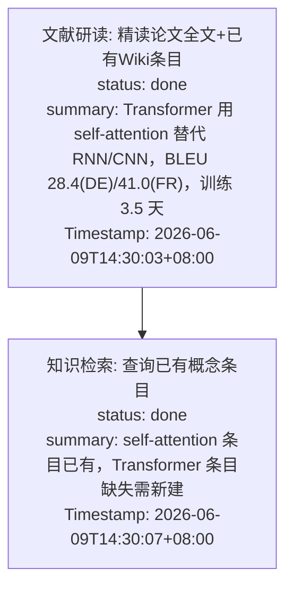

# Symbolic Offload Pipeline 实例：工具调用 → Mermaid 全流程

本文用一个完整的端到端例子，展示原始工具调用如何经过 L1 → L1.5 → L2 管线，最终变成一张 Mermaid 语义流程图。

---

## 场景设定

用户发送：**"帮我分析 Attention Is All You Need 这篇论文的核心创新点"**

Agent 在 ReAct 循环中依次发起 4 次工具调用。

---

## Step 0: Agent 发起原始工具调用

```
工具调用 1: read_file(path="raw/papers/attention-is-all-you-need.pdf")
  → 返回: 12,847 字符的 PDF 解析文本（论文全文）

工具调用 2: read_file(path="wiki/papers/attention-is-all-you-need.md")
  → 返回: 2,156 字符（已有的论文 wiki 页面）

工具调用 3: wiki_engine(action="query", entity_type="concept", keyword="self-attention")
  → 返回: 890 字符（已有的 self-attention 概念条目）

工具调用 4: wiki_engine(action="query", entity_type="concept", keyword="transformer")
  → 返回: 45 字符（未找到条目）
```

---

## Step 1: `wrap_tool_call` 收集 ToolPair

每次工具执行后，`ContextOffloadMiddleware.wrap_tool_call()` 创建一个 `ToolPair` 并放入缓冲区（`pipeline._pending_pairs`）。

**代码路径：** `graph/context_offload.py:75-82` → `pipeline.add_tool_pair()`

```python
# 第 1 次调用后
ToolPair(
    tool_name="read_file",
    tool_call_id="call_abc001",
    params={"path": "raw/papers/attention-is-all-you-need.pdf"},
    result="Abstract: The dominant sequence transduction models are based on complex recurrent or convolutional neural networks... [12,847 chars]",
    timestamp="2026-06-09T14:30:01+08:00",
)

# 第 2 次调用后
ToolPair(
    tool_name="read_file",
    tool_call_id="call_abc002",
    params={"path": "wiki/papers/attention-is-all-you-need.md"},
    result="# Attention Is All You Need\n核心贡献: 提出 Transformer 架构...",
    timestamp="2026-06-09T14:30:03+08:00",
)

# 第 3 次调用后
ToolPair(
    tool_name="wiki_engine",
    tool_call_id="call_abc003",
    params={"action": "query", "entity_type": "concept", "keyword": "self-attention"},
    result="## Self-Attention\n自注意力机制允许...",
    timestamp="2026-06-09T14:30:05+08:00",
)

# 第 4 次调用后 → 缓冲区满 4，触发 L1
ToolPair(
    tool_name="wiki_engine",
    tool_call_id="call_abc004",
    params={"action": "query", "entity_type": "concept", "keyword": "transformer"},
    result="未找到匹配的实体",
    timestamp="2026-06-09T14:30:07+08:00",
)
```

**触发逻辑（`pipeline.add_tool_pair()`）：**

```python
# pipeline.py:141-155
def add_tool_pair(self, pair: ToolPair) -> None:
    self._pending_pairs.append(pair)

    # 大小触发：单次输出 >= 3000 字符立即触发 L1
    size_threshold = self._config.get("l1_size_threshold", 3000)
    result_len = len(str(pair.result)) if pair.result else 0
    if result_len >= size_threshold:
        self._trigger_l1()
        return

    # 次数触发：缓冲区满 4 个 ToolPair
    threshold = self._config.get("force_trigger_threshold", 4)
    if len(self._pending_pairs) >= threshold:
        self._trigger_l1()
```

本例中第 4 个 ToolPair 加入后，`len(_pending_pairs) == 4 >= threshold`，触发 `_trigger_l1()`。

---

## Step 2: L1 — LLM 摘要提取

`_run_l1()` 把 4 个 ToolPair 发给 LLM。

### LLM 输入

**System prompt**（`l1_prompt.py:L1_SYSTEM_PROMPT`）：角色定位为"工具结果摘要器"，要求进行任务对齐、价值过滤、影响评估。

**User prompt** 构造过程：

```
## 最近的对话上下文（用于理解当前任务）：
[user]: 帮我分析 Attention Is All You Need 这篇论文的核心创新点

## Tool call/result pairs to summarize:
--- Tool Pair 1 ---
tool_call_id: call_abc001
timestamp: 2026-06-09T14:30:01+08:00
Tool: read_file
Params: {"path": "raw/papers/attention-is-all-you-need.pdf"}
Result: Abstract: The dominant sequence transduction models... [truncated to 2000 chars]

--- Tool Pair 2 ---
tool_call_id: call_abc002
timestamp: 2026-06-09T14:30:03+08:00
Tool: read_file
Params: {"path": "wiki/papers/attention-is-all-you-need.md"}
Result: # Attention Is All You Need\n核心贡献: 提出 Transformer 架构...

--- Tool Pair 3 ---
tool_call_id: call_abc003
timestamp: 2026-06-09T14:30:05+08:00
Tool: wiki_engine
Params: {"action": "query", "entity_type": "concept", "keyword": "self-attention"}
Result: ## Self-Attention\n自注意力机制允许...

--- Tool Pair 4 ---
tool_call_id: call_abc004
timestamp: 2026-06-09T14:30:07+08:00
Tool: wiki_engine
Params: {"action": "query", "entity_type": "concept", "keyword": "transformer"}
Result: 未找到匹配的实体

Summarize each pair into the JSON array format described.
```

### LLM 输出

```json
[
  {
    "tool_call": "read_file(attention-is-all-you-need.pdf)",
    "summary": "读取论文全文：Transformer 提出 encoder-decoder 架构，用 self-attention 替代 RNN/CNN，在 WMT 2014 上 BLEU 达 28.4(DE→EN)、41.0(FR→EN)，训练时间仅 3.5 天",
    "tool_call_id": "call_abc001",
    "timestamp": "2026-06-09T14:30:01+08:00",
    "score": 9
  },
  {
    "tool_call": "read_file(papers/attention-is-all-you-need.md)",
    "summary": "Wiki 已有论文条目：记录了核心架构图和 Multi-Head Attention 公式，但缺少实验对比数据",
    "tool_call_id": "call_abc002",
    "timestamp": "2026-06-09T14:30:03+08:00",
    "score": 7
  },
  {
    "tool_call": "wiki_engine(query, self-attention)",
    "summary": "已有 self-attention 概念条目，包含 scaled dot-product attention 公式和 QKV 说明",
    "tool_call_id": "call_abc003",
    "timestamp": "2026-06-09T14:30:05+08:00",
    "score": 6
  },
  {
    "tool_call": "wiki_engine(query, transformer)",
    "summary": "Transformer 概念条目不存在，需新建",
    "tool_call_id": "call_abc004",
    "timestamp": "2026-06-09T14:30:07+08:00",
    "score": 3
  }
]
```

### L1 产出物

| 产出 | 位置 | 说明 |
|------|------|------|
| 4 条 `OffloadEntry` | `offload-<sessionId>.jsonl` | 结构化摘要索引 |
| 4 个 `refs/<ref_id>.md` | `refs/` 目录 | 原始工具输出全文（供 `result_ref` 回溯） |
| `_null_entries` | 内存 | 4 条 entry 追加到待处理列表 |

`score` 字段含义（0-10）：越接近 10 表示摘要越能替代原文。score=9 意味着"读取论文全文"的 150 字摘要几乎可以替代 12,847 字原文；score=3 意味着"未找到条目"这个信息本身就很简短，不需要进一步压缩。

---

## Step 3: L1.5 — 任务生命周期判断

L1 完成后，`_check_l2_trigger()` 发现 `_null_entries >= 4`，先调用 `run_l15()` 判断任务状态。

**代码路径：** `pipeline._check_l2_trigger()` → `pipeline.run_l15()`

### LLM 输出

```json
{
  "taskCompleted": false,
  "isLongTask": true,
  "isContinuation": false,
  "newTaskLabel": "transformer-paper-analysis",
  "taskGoal": "分析 Transformer 论文的核心创新点并沉淀到 Wiki"
}
```

### L1.5 动作

`_apply_task_judgment()` 根据判断结果管理 MMD 文件生命周期：

```python
# pipeline.py:321-343
if judgment.is_long_task and judgment.new_task_label:
    # 创建新 MMD 文件
    self._state.mmd_counter += 1
    filename = f"{judgment.new_task_label}-{self._state.mmd_counter:03d}.mmd"
    # → "transformer-paper-analysis-001.mmd"
    self._state.active_mmd_file = filename
    self._state.active_mmd_id = judgment.new_task_label
```

结果：创建 `mmds/transformer-paper-analysis-001.mmd` 作为当前活跃的 Mermaid 文件。

---

## Step 4: L2 — LLM 生成 Mermaid

`_run_l2()` 把 4 条 L1 entry 发给 LLM。

**代码路径：** `pipeline._trigger_l2()` → `pipeline._run_l2(entries)`

### LLM 输入

**System prompt**（`l2_prompt.py:L2_SYSTEM_PROMPT`）：角色定位为"任务拓扑架构师"，要求弹性聚合、认知墓碑、结论导向。

**User prompt** 构造过程：

```
## 近期对话历史：
[user]: 帮我分析 Attention Is All You Need 这篇论文的核心创新点

## MMD prefix: transformer-paper-analysis
（所有节点 ID 必须以前缀开头，如 transformer-paper-analysis-N1, transformer-paper-analysis-N2...）

## Current task label: transformer-paper-analysis

## Existing Mermaid content:
(empty — create new)

## New offload entries to incorporate:
1. [call_abc001] read_file(attention-is-all-you-need.pdf) → 读取论文全文：Transformer 提出 encoder-decoder 架构... (2026-06-09T14:30:01+08:00)
2. [call_abc002] read_file(papers/attention-is-all-you-need.md) → Wiki 已有论文条目... (2026-06-09T14:30:03+08:00)
3. [call_abc003] wiki_engine(query, self-attention) → 已有 self-attention 概念条目... (2026-06-09T14:30:05+08:00)
4. [call_abc004] wiki_engine(query, transformer) → Transformer 概念条目不存在... (2026-06-09T14:30:07+08:00)

请根据系统指令生成/更新 Mermaid 流程图，并输出合法的 JSON 对象（含 node_mapping）。
```

### LLM 输出

```json
{
  "file_action": "write",
  "mmd_content": "```mermaid\n%% taskGoal: 分析 Transformer 论文核心创新点并沉淀到 Wiki\n%% progress: 35\n%% createdTime: 2026-06-09T14:30:07+08:00\n%% updatedTime: 2026-06-09T14:30:07+08:00\nflowchart TD\n\n    transformer-analysis-N1[\"文献研读: 精读论文全文+已有Wiki条目<br/>status: done<br/>summary: Transformer 用 self-attention 替代 RNN/CNN，BLEU 28.4(DE)/41.0(FR)，训练 3.5 天<br/>Timestamp: 2026-06-09T14:30:03+08:00\"]\n\n    transformer-analysis-N2[\"知识检索: 查询已有概念条目<br/>status: done<br/>summary: self-attention 条目已有，Transformer 条目缺失需新建<br/>Timestamp: 2026-06-09T14:30:07+08:00\"]\n\n    transformer-analysis-N1 --> transformer-analysis-N2\n```",
  "replace_blocks": [],
  "node_mapping": {
    "call_abc001": "transformer-analysis-N1",
    "call_abc002": "transformer-analysis-N1",
    "call_abc003": "transformer-analysis-N2",
    "call_abc004": "transformer-analysis-N2"
  }
}
```

### 关键转换：弹性聚合

LLM 把 4 个工具调用**聚合成 2 个语义节点**：

| 原始工具调用 | L1 摘要 | L2 聚合节点 | 聚合理由 |
|-------------|---------|-------------|---------|
| `call_abc001` — read_file(pdf) | 读取论文全文 | **N1: 文献研读** | 意图相同：都是阅读文献 |
| `call_abc002` — read_file(wiki) | 已有 Wiki 条目 | **N1: 文献研读** | 意图相同：都是阅读文献 |
| `call_abc003` — wiki_engine(self-attention) | 已有概念条目 | **N2: 知识检索** | 意图相同：都是查询现有知识 |
| `call_abc004` — wiki_engine(transformer) | 条目不存在 | **N2: 知识检索** | 意图相同：都是查询现有知识 |

`node_mapping` 记录了 `tool_call_id → Node ID` 的多对一映射关系。

---

## Step 5: 写入文件

`_run_l2()` 从 JSON 中提取 `mmd_content`，去掉 ` ```mermaid ` 包裹后写入文件。

**代码路径：** `pipeline.py:474-481`

```python
if l2_resp.file_action == "write" and l2_resp.mmd_content:
    mmd_text = l2_resp.mmd_content
    if mmd_text.startswith("```mermaid"):
        mmd_text = mmd_text[len("```mermaid"):].strip()
    if mmd_text.endswith("```"):
        mmd_text = mmd_text[:-3].strip()
    self._storage.write_mmd(self._state.active_mmd_file, mmd_text)
```

### 最终文件：`mmds/transformer-paper-analysis-001.mmd`



同时 `node_mapping` 回写到 JSONL（`storage.update_node_ids()`），让每条 L1 entry 都有了 `node_id`。

---

## 完整数据流总览

```
4 次原始工具调用（共 ~16,000 字符输出）
        │
        ▼ wrap_tool_call 收集 ToolPair
┌──────────────────────────────────┐
│ Buffer: [TP1, TP2, TP3, TP4]     │  ← count >= 4 触发
└──────────────────────────────────┘
        │
        ▼ L1: LLM 摘要（4 个 ToolPair → 4 条 OffloadEntry）
┌──────────────────────────────────────────────┐
│ OffloadEntry:                                 │
│   tool_call: "read_file(pdf)"                │
│   summary: "Transformer 用 self-attention..." │
│   score: 9                                   │
│   result_ref: "refs/abc123.md"               │
│ + 3 more entries                             │
└──────────────────────────────────────────────┘
        │
        ▼ L1.5: 任务判断
┌──────────────────────────────────────────────┐
│ TaskJudgment:                                 │
│   is_long_task: true                         │
│   new_task_label: "transformer-paper-analysis"│
│ → 创建 mmds/transformer-paper-analysis-001.mmd│
└──────────────────────────────────────────────┘
        │
        ▼ L2: LLM Mermaid 生成（4 条 entry → 2 个节点）
┌──────────────────────────────────────────────┐
│ node_mapping:                                │
│   call_abc001 → N1  (与 call_abc002 合并)    │
│   call_abc002 → N1                          │
│   call_abc003 → N2  (与 call_abc004 合并)    │
│   call_abc004 → N2                          │
│                                              │
│ mmd_content: flowchart TD                    │
│   N1["文献研读: ..."] → N2["知识检索: ..."]  │
└──────────────────────────────────────────────┘
        │
        ▼ 写入文件
mmds/transformer-paper-analysis-001.mmd  ← Mermaid 图
refs/abc123.md                           ← 原始工具输出
offload-session01.jsonl                  ← 结构化索引
```

---

## 各阶段信息压缩对比

| 阶段 | 输入 | 输出 | 压缩比 |
|------|------|------|--------|
| 原始工具调用 | — | ~16,000 字符 | 1x |
| L1 摘要 | 16,000 字符 | 4 条摘要 ~600 字符 + score | 27x |
| L2 Mermaid | 4 条摘要 | 2 个节点 ~400 字符 | 40x |
| L3 压缩（后续） | 上下文中的 ToolMessage | 替换为 L1 摘要 + MMD 注入 | 按 score 选择性压缩 |

核心价值：**16,000 字符的原始工具输出** → **~400 字符的 Mermaid 语义图**。LLM 后续可以通过 `result_ref` 路径读取完整原文。

---

## Step 6: 消费 — 摘要替换 + MMD 注入

L1/L1.5/L2 管线完成了**生产**（生成摘要和 Mermaid 图），接下来是**消费**：在后续对话中如何使用这些产物。消费包含两个独立操作，在 `before_model` hook 中执行。

### 操作 A：摘要替换（瘦身）

当 L3 温和压缩触发时，消息列表中的旧 `ToolMessage` 的 `content` 会被替换为 L1 摘要。

**替换前**（一条 `ToolMessage`，3800 字符）：

```
Abstract: The dominant sequence transduction models are based on complex
recurrent or convolutional neural networks that include an encoder and a
decoder... [3800 字符的论文全文]
```

**替换后**（约 200 字符）：

```
[Offloaded Tool Result | node: transformer-analysis-N1]
Summary: 读取论文全文：Transformer 提出 encoder-decoder 架构，用 self-attention 替代 RNN/CNN，BLEU 28.4(DE)/41.0(FR)，训练 3.5 天
result_ref: refs/abc123.md (read this file for full tool call and raw result)
```

替换保留了三个关键信息：
1. **node_id**：关联到 Mermaid 图中的节点（`transformer-analysis-N1`）
2. **summary**：LLM 生成的精炼摘要
3. **result_ref**：指向完整原文的路径，Agent 可按需读取

### 操作 B：MMD 注入（补视图）

`before_model` 会检查是否有活跃的 MMD 文件。如果有，将 Mermaid 流程图作为一条新的 `HumanMessage` 注入对话。

**注入的消息内容：**

```
<current_task_context>
【当前活跃任务的mermaid流程图】这是你最近正在执行的任务的阶段性记录
（此条下方的tool use未被汇总，进程可能有延迟，仅供参考）。

**任务目标:** 分析 Transformer 论文核心创新点并沉淀到 Wiki
**任务文件:** transformer-paper-analysis-001.mmd
**节点索引:** 可通过 node_id 在 offload JSONL 中查找对应的工具调用记录。

```mermaid
flowchart TD
  %%{ "taskGoal": "分析 Transformer 论文核心创新点并沉淀到 Wiki", "progress": "35" }%%

  transformer-analysis-N1["文献研读: 精读论文全文+已有Wiki条目
    status: done
    summary: Transformer 用 self-attention 替代 RNN/CNN..."]

  transformer-analysis-N2["知识检索: 查询已有概念条目
    status: done
    summary: self-attention 条目已有，Transformer 条目缺失需新建"]

  transformer-analysis-N1 --> transformer-analysis-N2
```

标记为 "doing" 的节点是近期焦点，"done" 的已完成。
请参考此保持方向感，避免重复已完成的工作。
</current_task_context>
```

**插入位置：** 最后一条 user 消息之后，避免拆断 `tool_use` / `tool_result` 配对。消息通过 `_mmd_context_message = "active"` 属性标记，避免被 L3 压缩误删。

### 两个操作的关系

| | 摘要替换 (瘦身) | MMD 注入 (补视图) |
|---|---|---|
| **操作对象** | 已有的 `ToolMessage` | 新增一条 `HumanMessage` |
| **操作方式** | 就地覆盖 `content` 字段 | `messages.insert()` 插入新消息 |
| **数据来源** | JSONL 中的 `summary` 字段 | MMD 文件的 Mermaid 内容 |
| **目的** | 压缩单条消息的 token 体积 | 给 LLM 提供任务全局视图 |
| **标记属性** | 无特殊标记 | `_mmd_context_message = "active"` |

两者互补：摘要替换负责"瘦身"（把胖消息变瘦），MMD 注入负责"补视图"（给 LLM 一张任务地图）。
