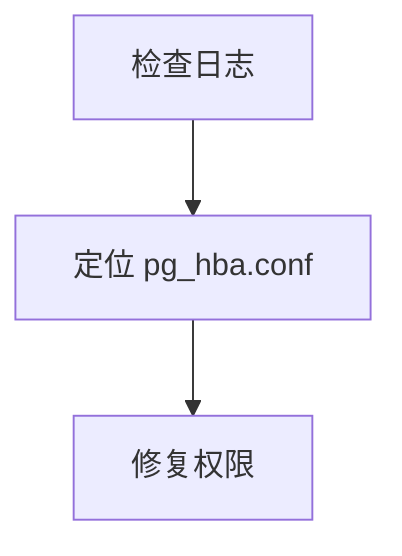

# Checkpoint 与 Session 管理详解

## 概览

Mini-OpenClaw 有两套独立的状态持久化机制，职责不同、存储不同、生命周期不同：

| 机制 | 存储位置 | 内容 | 生命周期 |
|------|----------|------|----------|
| **Session JSON** | `backend/sessions/*.json` | 原始消息历史（append-only） | 永久，手动清理 |
| **LangGraph Checkpointer** | 内存 / PostgreSQL | Agent 图状态（含压缩后的消息） | 会话级或永久（取决于后端） |

两者并行工作，互不写入对方。理解它们的区别是理解 miniOpenClaw 记忆系统的基础。

---

## 一、Session JSON 文件

### 1.1 存储结构

Session 文件由 `SessionManager`（`backend/service/session_manager.py`）管理，路径为：

```
backend/sessions/<session_id>.json
```

文件结构：

```json
{
  "id": "session-uuid",
  "title": "对话标题",
  "created_at": "2026-06-11T10:00:00",
  "updated_at": "2026-06-11T10:30:00",
  "compressed_context": "",
  "messages": [
    {
      "role": "user",
      "content": "帮我分析这段代码",
      "timestamp": "2026-06-11T10:00:00"
    },
    {
      "role": "assistant",
      "content": "这段代码的问题在于...",
      "timestamp": "2026-06-11T10:00:05"
    }
  ]
}
```

### 1.2 写入时机

消息在 SSE 流式响应完成后追加写入（`api/chat.py:97-104`）：

```python
# "done" event 时保存
if event == "done":
    await session_manager.save_message(session_id, user_msg)
    await session_manager.save_message(session_id, assistant_msg)
```

### 1.3 关键特性

- **Append-only**：消息只追加，不修改、不删除
- **不写入摘要**：SummarizationMiddleware 的压缩结果**不会**回写到 session JSON
- **不写入 offload 摘要**：ContextOffload 的 L1 摘要也不会写入
- **原始记录**：保存的是用户发的和助手回的原始文本，是对话的"审计日志"

### 1.4 压缩历史（SessionManager.compress_history）

SessionManager 有自己的 `compress_history()` 方法，与 SummarizationMiddleware 独立：

- 将旧消息归档到 `compressed_context` 字段
- 保留最近 N 条消息在 `messages` 数组中
- 主要用于 v1 记忆系统的会话加载，不参与 agent 图的状态管理

---

## 二、LangGraph Checkpointer

### 2.1 作用

Checkpointer 按 `thread_id` 持久化 LangGraph 的完整 agent 状态，包括：

- 消息历史（含 Summarization 压缩后的摘要消息）
- 工具调用状态（pending writes）
- Channel values（图节点间传递的状态）
- 图执行元数据（step、checkpoint_id 等）

### 2.2 两种后端

| 后端 | 配置 | 特点 |
|------|------|------|
| `InMemorySaver`（默认） | 无需配置 | 内存存储，**重启丢失** |
| `AsyncPostgresSaver` | `CHECKPOINTER=postgres` | PostgreSQL 持久化，**重启保留** |

### 2.3 初始化代码

`backend/graph/checkpointer.py`：

```python
# Postgres 模式
from langgraph.checkpoint.postgres.aio import AsyncPostgresSaver

dsn = _postgres_dsn()
_postgres_cm = AsyncPostgresSaver.from_conn_string(dsn)
_default_saver = await _postgres_cm.__aenter__()
await _default_saver.setup()  # 创建 checkpoints / checkpoint_blobs / checkpoint_writes 表
```

`setup()` 会在 PostgreSQL 中创建三张表：

| 表名 | 用途 |
|------|------|
| `checkpoints` | 主状态行（thread_id, checkpoint JSON, metadata） |
| `checkpoint_blobs` | 序列化的 channel values |
| `checkpoint_writes` | pending 的写操作 |

### 2.4 写入时机

每次 agent 图执行完毕，LangGraph 自动将当前状态写入 checkpointer。这发生在 `AsyncPregelLoop.__aexit__()` 中，对用户代码透明。

### 2.5 读取时机与 PG 查询路径

**每次 `agent.astream()` 调用时**，LangGraph 在图执行前先从 PG 读取状态。完整调用链：

```
agent.astream(input, config={"configurable": {"thread_id": "xxx"}})
  │
  ▼
AsyncPregelLoop.__aenter__()                      # langgraph/pregel/loop.py:1854
  │
  ▼
self.checkpointer.aget_tuple(self.checkpoint_config)  # loop.py:1879
  │
  ▼
AsyncPostgresSaver.aget_tuple(config)              # langgraph/checkpoint/postgres/aio.py:181
  │
  ├── thread_id = config["configurable"]["thread_id"]
  │
  ▼
cur.execute(SELECT_SQL + where, (thread_id, ...))  # aio.py:206
  │
  ▼  ← 一条 SQL 读三张表
  │
  ├── checkpoints          (主状态)
  ├── checkpoint_blobs     (channel values，通过 channel_versions JOIN)
  └── checkpoint_writes    (pending writes，子查询)
  │
  ▼
self.checkpoint = saved.checkpoint                 # loop.py:1903
self.channels = await achannels_from_checkpoint()  # loop.py:1918
  │
  ▼  ← 状态恢复完毕，图节点开始执行
```

核心 SQL（`langgraph/checkpoint/postgres/base.py:93-118`）：

```sql
SELECT
    thread_id,
    checkpoint,
    checkpoint_ns,
    checkpoint_id,
    parent_checkpoint_id,
    metadata,
    (
        SELECT array_agg(array[bl.channel::bytea, bl.type::bytea, bl.blob])
        FROM jsonb_each_text(checkpoint -> 'channel_versions')
        INNER JOIN checkpoint_blobs bl
            ON bl.thread_id = checkpoints.thread_id
            AND bl.checkpoint_ns = checkpoints.checkpoint_ns
            AND bl.channel = jsonb_each_text.key
            AND bl.version = jsonb_each_text.value
    ) AS channel_values,
    (
        SELECT array_agg(array[cw.task_id::text::bytea, cw.channel::bytea,
                                cw.type::bytea, cw.blob]
                          ORDER BY cw.task_id, cw.idx)
        FROM checkpoint_writes cw
        WHERE cw.thread_id = checkpoints.thread_id
            AND cw.checkpoint_ns = checkpoints.checkpoint_ns
            AND cw.checkpoint_id = checkpoints.checkpoint_id
    ) AS pending_writes
FROM checkpoints
WHERE thread_id = %s AND checkpoint_ns = %s
ORDER BY checkpoint_id DESC
LIMIT 1
```

### 2.6 断线重连

`backend/api/chat.py:123-134` 捕获 Postgres 连接错误后自动重连：

```python
try:
    async for mode, payload in agent.astream(...):
        ...
except (asyncpg.PostgresConnectionError, ...) as e:
    await reconnect_checkpointer_async()  # 关闭旧连接 → 重建新连接
    # 重试一次请求
    async for mode, payload in agent.astream(...):
        ...
```

`reconnect_checkpointer_async()`（`checkpointer.py:78-91`）：
1. 关闭旧连接（忽略异常）
2. 用相同的 DSN 重建 `AsyncPostgresSaver`
3. 调用 `setup()` 确保表存在

### 2.7 后端重启后的恢复

```
后端重启
  │
  ▼
app.py lifespan → init_checkpointer_async()
  │
  ├── CHECKPOINTER=postgres
  │     → AsyncPostgresSaver.from_conn_string(dsn)
  │     → setup()  (幂等，表已存在则跳过)
  │     → get_checkpointer() 返回新的 saver 实例
  │
  └── CHECKPOINTER 未设置
        → InMemorySaver()  (空的，之前的对话全部丢失)
  │
  ▼
用户发消息 → agent.astream(config={"thread_id": "xxx"})
  │
  ▼
aget_tuple(thread_id="xxx") → PG SELECT → 恢复上次的 checkpoint
  │
  ▼
对话从上次中断的地方继续
```

---

## 三、SummarizationMiddleware（对话压缩）

### 3.1 触发条件

由 LangChain 内置的 `SummarizationMiddleware` 实现（`langchain/agents/middleware/summarization.py`）。

配置（`agent_factory.py:203-211`）：

```python
SummarizationMiddleware(
    model=config.llm,
    trigger=("messages", 50),   # 消息数 >= 50 时触发
    keep=("messages", 20),      # 保留最近 20 条
    summary_prompt=SUMMARY_PROMPT_ZH,
)
```

### 3.2 内部执行流程

```
before_model hook 被调用
  │
  ▼
_should_summarize()           # 消息数 >= trigger?
  │ Yes
  ▼
_determine_cutoff_index()     # 找到安全切割点（不拆断 AI/Tool 配对）
  │
  ▼
_partition_messages()          # 分为 [待压缩] + [保留]
  │
  ▼
_create_summary()              # 调用 LLM 生成摘要
  │  ├── 截断到 4000 tokens
  │  ├── get_buffer_string() 格式化
  │  └── LLM 调用（使用 SUMMARY_PROMPT_ZH）
  │
  ▼
_build_new_messages()
  │  ├── RemoveMessage(REMOVE_ALL_MESSAGES)  # 删除所有旧消息
  │  ├── HumanMessage(summary)               # 插入摘要
  │  └── 保留的最近 20 条消息
  │
  ▼
返回 {"messages": new_messages}
```

### 3.3 摘要 Prompt（中文优化）

`SUMMARY_PROMPT_ZH`（`agent_factory.py:30-54`）要求 LLM 输出四个结构化部分：

```markdown
## 会话目标
用户的主要目标或请求是什么？

## 摘要
关键选择、结论、策略，被否决的方案及原因。

## 产出物
创建/修改的文件路径和变更描述。

## 后续步骤
待完成任务，下一步应该做什么？
```

### 3.4 安全切割点

`_find_safe_cutoff_point()` 确保不会在 `tool_use` 和对应的 `tool_result` 之间切割，避免产生不完整的消息对。

---

## 四、ContextOffloadMiddleware（符号化短期记忆）

### 4.1 与 Summarization 的区别

| 维度 | Summarization | ContextOffload |
|------|---------------|----------------|
| 作用对象 | 整个消息历史 | 单条工具结果 |
| 触发条件 | 消息数 >= 50 | context_ratio >= 0.3 |
| 压缩方式 | LLM 生成结构化摘要 | 四阶段管线（L1/L1.5/L2/L3） |
| 输出 | 一条摘要消息替换所有旧消息 | 逐条替换 ToolMessage + 注入 Mermaid 图 |
| 执行 hook | `before_model` | `wrap_tool_call` + `before_model` |

### 4.2 两个独立操作

ContextOffloadMiddleware 在 `before_model` 中执行两个独立操作：

**操作 1：摘要替换（瘦身）**

将旧的 `ToolMessage.content` 替换为 L1 摘要：

```
[Offloaded Tool Result | node: N2]
Summary: 根因：pg_hba.conf 权限不足导致 PostgreSQL 启动失败
result_ref: refs/2026-06-07T14-30-08.md
```

三级压缩策略：

| 级别 | context_ratio | 策略 |
|------|---------------|------|
| 温和 | >= 0.5 | 按 score 从高到低替换 ToolMessage |
| 激进 | >= 0.85 | 删除最旧的 30% 消息 |
| 紧急 | >= 0.95 | 强制截断到 60% |

**操作 2：MMD 注入（补视图）**

将活跃任务的 Mermaid 流程图作为 `HumanMessage` 注入到最后一条 user 消息之后：

```xml
<current_task_context>
【当前活跃任务的mermaid流程图】
**任务目标:** 分析 PostgreSQL 启动失败的根因
**任务文件:** mmds/pg-diagnosis-1.mmd


</current_task_context>
```

---

## 五、三者协作关系

```
用户发消息
    │
    ▼
┌─────────────────────────────────────────────────────┐
│  Checkpointer: 从 PG 读取上次的 checkpoint           │
│  (aget_tuple → SELECT FROM checkpoints)              │
└─────────────────────────────────────────────────────┘
    │
    ▼
┌─────────────────────────────────────────────────────┐
│  ContextOffload.before_model:                        │
│  1. 摘要替换：旧 ToolMessage → L1 摘要文本            │
│  2. MMD 注入：插入活跃任务的 Mermaid 图               │
└─────────────────────────────────────────────────────┘
    │
    ▼
┌─────────────────────────────────────────────────────┐
│  Summarization.before_model:                         │
│  消息数 >= 50 → LLM 压缩为结构化摘要                  │
│  删除旧消息，保留摘要 + 最近 20 条                    │
└─────────────────────────────────────────────────────┘
    │
    ▼
┌─────────────────────────────────────────────────────┐
│  LLM 调用（上下文窗口已优化）                         │
└─────────────────────────────────────────────────────┘
    │
    ▼
┌─────────────────────────────────────────────────────┐
│  ContextOffload.wrap_tool_call:                      │
│  拦截工具结果 → 收集 ToolPair → L1 摘要 + L2 Mermaid  │
└─────────────────────────────────────────────────────┘
    │
    ▼
┌─────────────────────────────────────────────────────┐
│  Checkpointer: 将更新后的状态写入 PG                   │
│  (aput → INSERT INTO checkpoints)                    │
└─────────────────────────────────────────────────────┘
    │
    ▼
┌─────────────────────────────────────────────────────┐
│  Session JSON: 追加原始消息（不包含摘要）               │
│  (save_message → append to sessions/*.json)          │
└─────────────────────────────────────────────────────┘
```

### 中间件执行顺序

```
Guardian → HarnessSecurity → ContextOffload → Summarization → HarnessReview
```

顺序很重要：
- **ContextOffload 在 Summarization 之前**：先瘦身工具结果，再做全局压缩
- **Summarization 在 HarnessReview 之前**：review 看到的是压缩后的对话

---

## 六、数据流全景图

```
┌──────────────────────────────────────────────────────────────────┐
│                        PostgreSQL                                 │
│                                                                   │
│  ┌─────────────────────┐  ┌──────────────────────────────────┐   │
│  │  checkpoints         │  │  checkpoint_blobs                │   │
│  │  ─────────────────   │  │  ────────────────────────────    │   │
│  │  thread_id           │  │  thread_id                       │   │
│  │  checkpoint (JSON)   │  │  channel, version, blob          │   │
│  │  metadata            │  │  (序列化的 channel values)        │   │
│  │  parent_checkpoint_id│  └──────────────────────────────────┘   │
│  └─────────────────────┘                                          │
│           │ JOIN                                                   │
│  ┌─────────────────────┐                                          │
│  │  checkpoint_writes   │                                          │
│  │  ─────────────────   │                                          │
│  │  thread_id           │                                          │
│  │  checkpoint_id       │                                          │
│  │  task_id, channel    │                                          │
│  │  blob (pending data) │                                          │
│  └─────────────────────┘                                          │
└──────────────────────────────────────────────────────────────────┘

┌──────────────────────────────────────────────────────────────────┐
│                     文件系统                                       │
│                                                                   │
│  sessions/*.json          ← 原始消息（append-only）               │
│  offload/*.jsonl          ← L1 结构化摘要索引                     │
│  offload/refs/*.md        ← 工具结果原文                          │
│  offload/mmds/*.mmd       ← Mermaid 任务流程图                    │
│  offload/state.json       ← Offload 插件状态                      │
└──────────────────────────────────────────────────────────────────┘
```

---

## 七、常见问题

### Q: Summarization 压缩后，session JSON 里还有完整对话吗？

**有。** Session JSON 是 append-only 的原始记录，SummarizationMiddleware 只修改 checkpointer 中的状态，不回写 session JSON。所以 session JSON 始终保留完整的原始对话。

### Q: 后端重启后，对话能恢复到哪一步？

取决于 checkpointer 后端：
- `InMemorySaver`：**全部丢失**，从零开始
- `AsyncPostgresSaver`：恢复到**最后一次 checkpoint**（通常是上一轮对话结束时的状态）

### Q: Checkpointer 和 Session JSON 会冲突吗？

**不会。** 它们是完全独立的系统：
- Session JSON 记录原始消息（审计用途）
- Checkpointer 管理 agent 图状态（运行时用途）
- 两者通过 `thread_id` / `session_id` 关联，但不互相读写

### Q: 如果 PG 连接断了怎么办？

`chat.py` 捕获连接异常后自动重连（`reconnect_checkpointer_async()`），重试一次请求。如果重连也失败，对话会报错退出，但 session JSON 中已保存的消息不受影响。

### Q: ContextOffload 和 Summarization 会重复压缩吗？

**会各自独立工作，但不会冲突。** ContextOffload 处理的是单条工具结果的压缩（wrap_tool_call），Summarization 处理的是整个消息历史的压缩（before_model）。ContextOffload 先执行，把冗长的工具结果瘦身后再交给 Summarization 判断是否需要全局压缩。
